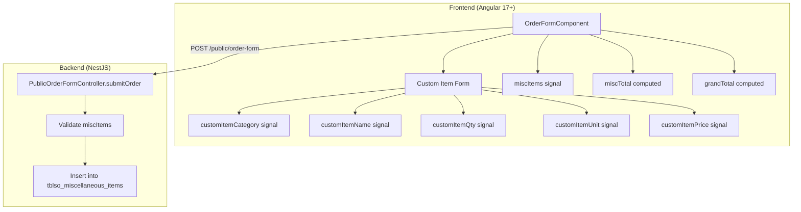

# Design Document: Custom Additional Items

## Overview

This feature refactors the Additional Items section of the public order form from a tab-based catalog browsing experience to a unified custom item entry form. The current implementation requires users to switch between category tabs (Material, Electrical, Excess, General) to browse pre-defined materials from the database, with a separate "Custom Item" toggle for manual entry. The new design removes all catalog dependencies and presents a single form where users enter item details and agreed-upon pricing directly.

**Key Design Decisions:**

1. **Frontend-only refactor** — The backend already supports custom items (items without `materialId`). No backend schema or insertion logic changes are needed.
2. **Signal simplification** — Remove `availableMaterials`, `activeMiscCategory`, `customItemMode`, and `filteredMaterials`. Add `customItemCategory` signal.
3. **No API call removal on backend** — The `GET /public/order-form/materials` endpoint remains available for other consumers but the order form component stops calling it.
4. **Category preserved** — Items still carry a category field for backend record-keeping, but it's selected via a dropdown rather than tab navigation.

## Architecture

The change is contained within the order form component and its template. No new modules, services, or routing changes are required.



**Data flow:**
1. User fills in the Custom Item Form fields (name, category, qty, unit, price)
2. User clicks "Add Item" → `addCustomMiscItem()` appends to `miscItems` signal
3. Template reactively renders the Item List from `miscItems()`
4. `miscTotal` and `grandTotal` computed signals update automatically
5. On order submission, `miscItems()` is serialized into the POST payload
6. Backend validates and inserts each item into `tblso_miscellaneous_items`

## Components and Interfaces

### Modified Component: `OrderFormComponent`

**File:** `frontend/src/app/pages/order-form/order-form.component.ts`

#### Signals to Remove
| Signal | Reason |
|--------|--------|
| `availableMaterials` | No longer loading catalog materials |
| `activeMiscCategory` | Category tabs removed |
| `customItemMode` | Entire section is now custom-only |

#### Computed to Remove
| Computed | Reason |
|----------|--------|
| `filteredMaterials` | Depended on `availableMaterials` and `activeMiscCategory` |

#### Signals to Add
| Signal | Type | Default | Purpose |
|--------|------|---------|---------|
| `customItemCategory` | `signal<string>` | `'general'` | Selected category from dropdown |

#### Signals to Keep (unchanged)
| Signal | Type | Default |
|--------|------|---------|
| `miscItems` | `signal<MiscCartItem[]>` | `[]` |
| `showMiscSection` | `signal<boolean>` | `false` |
| `customItemName` | `signal<string>` | `''` |
| `customItemQty` | `signal<number>` | `1` |
| `customItemUnit` | `signal<string>` | `'pcs'` |
| `customItemPrice` | `signal<number>` | `0` |

#### Methods to Remove
| Method | Reason |
|--------|--------|
| `loadMaterials()` | No longer fetching catalog materials |
| `addMiscItem(material)` | Catalog-based add removed |

#### Methods to Modify
| Method | Change |
|--------|--------|
| `addCustomMiscItem()` | Use `customItemCategory()` instead of `activeMiscCategory()` for the category field. Reset `customItemCategory` to `'general'` after adding. |
| `ngOnInit()` | Remove `this.loadMaterials()` call |

#### Methods to Keep (unchanged)
| Method | Purpose |
|--------|---------|
| `toggleMiscSection()` | Toggle visibility of the section |
| `removeMiscItem(index)` | Remove item from list by index |

### Template Changes

**File:** `frontend/src/app/pages/order-form/order-form.component.html`

The Additional Items section template will be restructured:

**Remove:**
- Category tab buttons (`material`, `electrical`, `excess`, `general` loop)
- "Custom Item" toggle button
- `@if (customItemMode())` conditional wrapper around the form
- Available Materials list (`filteredMaterials()` rendering)
- "No materials available" empty state

**Add:**
- Category dropdown (`<select>`) within the form with options: Material, Electrical, Excess, General
- The form is always visible when the section is expanded (no toggle needed)

**Keep:**
- Section expand/collapse button (`toggleMiscSection()`)
- Item list rendering (`miscItems()` loop)
- Remove button per item
- Misc Subtotal display

### Interface: `MiscCartItem`

No changes needed. The existing interface already supports custom items:

```typescript
interface MiscCartItem {
  materialId?: number;    // Optional — not set for custom items
  category: string;       // 'material' | 'electrical' | 'excess' | 'general'
  itemName: string;
  quantity: number;
  unit: string;
  unitPrice: number;
  isInclusion: boolean;
}
```

### Interface: `MiscItemPayload` (Backend DTO)

No changes needed. Already supports custom items without `materialId`.

## Data Models

### Frontend State Model

```typescript
// Signals state for the Additional Items section
{
  showMiscSection: boolean;          // Section visibility toggle
  customItemCategory: string;        // 'general' (default) | 'material' | 'electrical' | 'excess'
  customItemName: string;            // '' (default)
  customItemQty: number;             // 1 (default)
  customItemUnit: string;            // 'pcs' (default)
  customItemPrice: number;           // 0 (default)
  miscItems: MiscCartItem[];         // [] (default)
}
```

### Computed Values

```typescript
miscTotal = computed(() => miscItems().reduce((sum, i) => sum + i.quantity * i.unitPrice, 0));
grandTotal = computed(() => cartTotal() + miscTotal());
```

### Backend Database Table (existing, no changes)

**Table:** `tblso_miscellaneous_items`

| Column | Type | Notes |
|--------|------|-------|
| sales_id | integer | FK to sales order |
| category | varchar | 'material', 'electrical', 'excess', 'general' |
| item_name | varchar | Required, non-empty |
| description | varchar | Optional |
| material_id | integer | NULL for custom items |
| quantity | numeric | Must be > 0 |
| unit | varchar | Required |
| unit_price | numeric | Must be >= 0 |
| total_price | numeric | Computed: quantity × unit_price |
| is_inclusion | boolean | Default false |


## Correctness Properties

*A property is a characteristic or behavior that should hold true across all valid executions of a system — essentially, a formal statement about what the system should do. Properties serve as the bridge between human-readable specifications and machine-verifiable correctness guarantees.*

### Property 1: Valid item addition preserves all fields

*For any* valid item name (non-empty, non-whitespace-only string), any category in {material, electrical, excess, general}, any quantity ≥ 1, any unit string, and any unitPrice ≥ 0, calling `addCustomMiscItem()` SHALL append exactly one item to `miscItems` with the exact category, itemName, quantity, unit, and unitPrice values that were set in the form signals.

**Validates: Requirements 2.2**

### Property 2: Whitespace-only names are rejected

*For any* string composed entirely of whitespace characters (including empty string, spaces, tabs, newlines), calling `addCustomMiscItem()` SHALL NOT modify the `miscItems` list — its length and contents remain unchanged.

**Validates: Requirements 2.4**

### Property 3: Form resets to defaults after successful add

*For any* valid form state (non-empty item name, any category, any quantity ≥ 1, any unit, any price ≥ 0), after a successful call to `addCustomMiscItem()`, the form signals SHALL be: customItemName = '', customItemCategory = 'general', customItemQty = 1, customItemUnit = 'pcs', customItemPrice = 0.

**Validates: Requirements 2.5**

### Property 4: miscTotal is always the sum of item totals

*For any* list of MiscCartItems in the `miscItems` signal, `miscTotal()` SHALL equal the sum of `(item.quantity × item.unitPrice)` for every item in the list. This holds after additions, removals, or any sequence of operations.

**Validates: Requirements 2.3, 3.2, 3.4**

### Property 5: Remove at index reduces list by one

*For any* non-empty `miscItems` list and any valid index `i` (0 ≤ i < list.length), calling `removeMiscItem(i)` SHALL result in a list whose length is exactly one less than before, and the item previously at index `i` SHALL no longer be present at that position.

**Validates: Requirements 3.3**

### Property 6: Backend rejects invalid miscItems

*For any* miscItem payload where at least one of the following holds: (a) itemName is empty/missing/whitespace-only, (b) category is not in {excess, electrical, material, general}, (c) quantity ≤ 0, or (d) unitPrice < 0 — the backend validation SHALL reject the request with a descriptive error message and NOT insert the item into the database.

**Validates: Requirements 5.1, 5.2, 5.3, 5.4**

## Error Handling

### Frontend Error Handling

| Scenario | Behavior |
|----------|----------|
| Empty item name on "Add Item" click | Silently reject — do not add to list, no error message displayed (existing behavior) |
| Quantity < 1 entered | HTML `min="1"` attribute prevents via browser validation; signal defaults to 1 |
| Unit price < 0 entered | HTML `min="0"` attribute prevents via browser validation; signal defaults to 0 |
| Order submission fails | Existing error handling displays `errorMsg` signal content |

**Design decision:** The frontend uses HTML5 form constraints (`min` attributes) as the first line of defense. The `addCustomMiscItem()` method only checks for empty/whitespace item name since the numeric inputs are constrained by the browser. This matches the existing pattern in the codebase.

### Backend Error Handling

The existing validation in `PublicOrderFormController.submitOrder()` already handles all error cases:

| Validation | Error Response |
|------------|---------------|
| Empty/missing `itemName` | 400: `"Misc item at index {i}: itemName is required"` |
| Invalid `category` | 400: `"Misc item at index {i}: category must be one of: excess, electrical, material, general"` |
| `quantity` ≤ 0 | 400: `"Misc item at index {i}: quantity must be a positive number"` |
| `unitPrice` < 0 | 400: `"Misc item at index {i}: unitPrice must be a non-negative number"` |
| Missing `unit` | 400: `"Misc item at index {i}: unit is required"` |

No changes needed to backend error handling.

## Testing Strategy

### Unit Tests (Example-Based)

These verify specific UI states and behaviors:

1. **Form rendering** — When section is expanded, all form fields are present with correct defaults (Req 1.1–1.6)
2. **Absence of catalog UI** — No category tabs, no materials list, no "Custom Item" toggle (Req 1.7, 1.8, 6.2, 6.3)
3. **No materials API call** — Component init does not call `/public/order-form/materials` (Req 6.1)
4. **Add Item button** — Button labeled "Add Item" is present (Req 2.1)
5. **Item list rendering** — Each item displays category, name, qty, unit, unit price, and total (Req 3.1)
6. **Empty list submission** — Order submits with empty array when no items added (Req 4.3)
7. **Payload structure** — Submitted items include category, itemName, quantity, unit, unitPrice, isInclusion (Req 4.1, 4.2)

### Property-Based Tests

**Library:** [fast-check](https://github.com/dubzzz/fast-check) (already standard for TypeScript/JavaScript PBT)

**Configuration:** Minimum 100 iterations per property test.

Each property test references its design document property:

| Test | Property | Tag |
|------|----------|-----|
| Valid item addition | Property 1 | Feature: custom-additional-items, Property 1: Valid item addition preserves all fields |
| Whitespace rejection | Property 2 | Feature: custom-additional-items, Property 2: Whitespace-only names are rejected |
| Form reset | Property 3 | Feature: custom-additional-items, Property 3: Form resets to defaults after successful add |
| miscTotal invariant | Property 4 | Feature: custom-additional-items, Property 4: miscTotal is always the sum of item totals |
| Remove at index | Property 5 | Feature: custom-additional-items, Property 5: Remove at index reduces list by one |
| Backend validation | Property 6 | Feature: custom-additional-items, Property 6: Backend rejects invalid miscItems |

### Integration Tests

1. **End-to-end submission** — Submit an order with miscItems and verify items are stored in `tblso_miscellaneous_items` with correct `total_price` (Req 5.5)
2. **Payload round-trip** — Items added in the frontend arrive at the backend with all fields intact (Req 4.1)

### Test Generators (for Property Tests)

```typescript
// Valid item name: non-empty, non-whitespace-only string
const validItemName = fc.string({ minLength: 1 }).filter(s => s.trim().length > 0);

// Valid category
const validCategory = fc.constantFrom('material', 'electrical', 'excess', 'general');

// Invalid category (any string not in the valid set)
const invalidCategory = fc.string().filter(s => !['material', 'electrical', 'excess', 'general'].includes(s));

// Valid quantity (positive integer)
const validQuantity = fc.integer({ min: 1, max: 10000 });

// Valid unit price (non-negative)
const validUnitPrice = fc.float({ min: 0, max: 1000000, noNaN: true });

// Invalid quantity (zero or negative)
const invalidQuantity = fc.oneof(fc.constant(0), fc.integer({ max: -1 }));

// Invalid unit price (negative)
const invalidUnitPrice = fc.float({ max: -0.01, noNaN: true });

// Whitespace-only strings
const whitespaceOnly = fc.stringOf(fc.constantFrom(' ', '\t', '\n', '\r')).filter(s => s.length >= 0);
```
