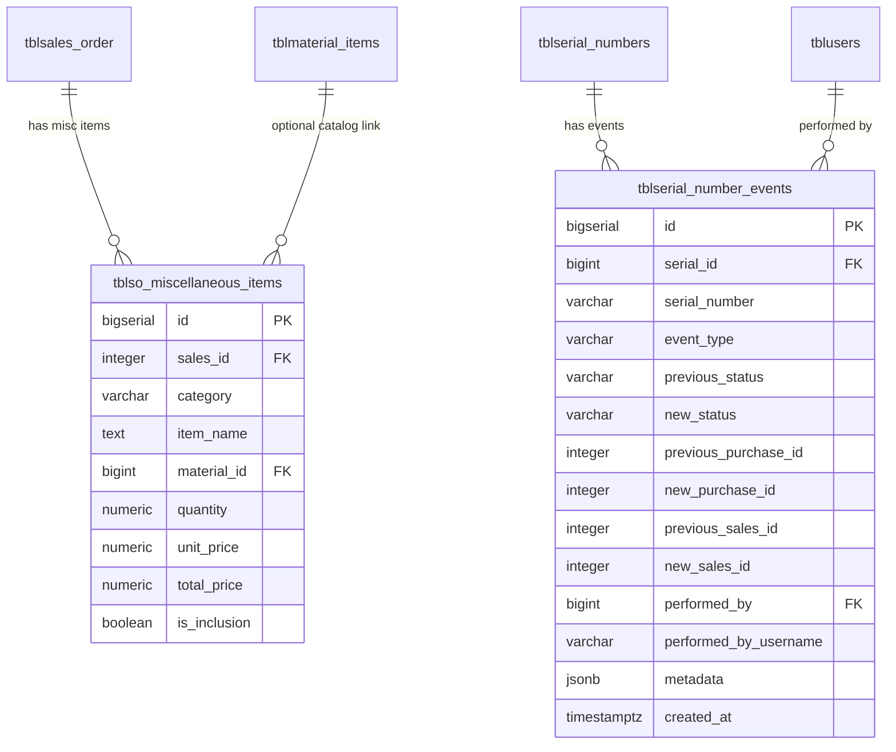

# Design Document: Phase 2 Improvements

## Overview

This design covers two feature areas for the HVAC Inventory & Sales Management System:

1. **Order Form Enhancements** — Display capacity SRP during product selection and add a miscellaneous items section for non-unit line items (excess materials, electricals, general items).
2. **Serial Number Traceability** — Implement an append-only event log that records every serial number state change, providing full lifecycle visibility and recovery of "missing" serials.

Both features are additive — they introduce new tables, services, and UI sections without modifying existing table structures. The architecture follows the established patterns: NestJS controllers/services with raw SQL via `DatabaseService`, Angular standalone components with signals, and PostgreSQL with the `tbl` prefix convention.

## Architecture

### High-Level Component Diagram

```mermaid
graph TB
    subgraph Frontend [Angular Frontend]
        OF[Order Form Component]
        SH[Serial History Component]
    end

    subgraph Backend [NestJS Backend]
        POFC[PublicOrderFormController]
        SNC[SerialNumberController]
        SELS[SerialEventLogService]
        SNS[SerialNumberService]
        DB[DatabaseService]
    end

    subgraph Database [PostgreSQL]
        MISC[tblso_miscellaneous_items]
        EVENTS[tblserial_number_events]
        MI[tblmaterial_items]
        SN[tblserial_numbers]
    end

    OF -->|GET /public/order-form/materials| POFC
    OF -->|POST /public/order-form miscItems[]| POFC
    POFC --> DB --> MISC
    POFC --> DB --> MI

    SH -->|GET /serial-numbers/:id/history| SNC
    SH -->|GET /serial-numbers/search-history| SNC
    SNC --> SELS
    SELS --> DB --> EVENTS

    SNS -->|logEvent on state change| SELS
    SNS --> DB --> SN
```

### Design Decisions

| Decision | Rationale |
|----------|-----------|
| Separate `tblso_miscellaneous_items` table | Misc items are free-text or category-based; they don't map 1:1 to internal material codes. Keeps the existing `tblso_material_items` (BOM-based) untouched. |
| Append-only event log for serials | Standard asset-tracking pattern. Never mutate history rows — only insert. Enables full recovery of "lost" serials. |
| `SerialEventLogService` as a separate injectable | Single responsibility; can be injected into `SerialNumberService` without circular deps. Failure in logging must not abort parent operations. |
| Denormalized `serial_number` in events table | Allows fast lookup by serial string even if the parent `tblserial_numbers` record is deleted or its serial value changes. |
| Materials endpoint returns items grouped by category | Frontend needs category tabs; grouping server-side reduces client logic and payload parsing. |
| Event service accepts optional `PoolClient` | Allows participation in the caller's transaction when available, ensuring atomicity where desired while still being fire-and-forget safe. |

## Components and Interfaces

### 1. Order Form — Materials Endpoint

**New endpoint:** `GET /public/order-form/materials`

```typescript
// Response shape
interface MaterialsResponse {
  success: boolean;
  items: {
    category: string; // 'excess' | 'electrical' | 'material' | 'general'
    materials: Array<{
      id: number;
      code: string;
      name: string;
      unit: string;
      unitPrice: number;
    }>;
  }[];
}
```

This endpoint queries `tblmaterial_items` (the ledger-based catalog) and groups active items by a category mapping. Since `tblmaterial_items` doesn't have a `category` column, the grouping will be derived from a prefix convention in the `code` field or a new `category` column added to `tblmaterial_items`. Given the existing schema, we'll add a `category` column with a default of `'general'` to `tblmaterial_items`.

**Alternative:** Use the `tblmaterials` table (Section 11.5 in schema) which already has `unit_price` and `sell_price`. This is the product-level material inventory and is more appropriate for customer-facing pricing. We'll use `tblmaterials` for the materials endpoint since it has pricing data.

### 2. Order Form — Miscellaneous Items Submission

**Updated endpoint:** `POST /public/order-form`

New optional field in payload:
```typescript
interface MiscItemPayload {
  category: 'excess' | 'electrical' | 'material' | 'general';
  itemName: string;
  description?: string;
  materialId?: number; // optional link to tblmaterial_items
  quantity: number;
  unit: string;
  unitPrice: number;
  isInclusion: boolean;
}

// Added to PublicOrderFormDto
miscItems?: MiscItemPayload[];
```

### 3. Serial Event Log Service

**New service:** `SerialEventLogService`

```typescript
interface LogEventParams {
  serialId: number;
  serialNumber: string;
  eventType: SerialEventType;
  previousStatus?: string | null;
  newStatus?: string | null;
  previousPurchaseId?: number | null;
  newPurchaseId?: number | null;
  previousSalesId?: number | null;
  newSalesId?: number | null;
  previousBranchId?: number | null;
  newBranchId?: number | null;
  previousCustomerId?: string | null;
  newCustomerId?: string | null;
  performedBy?: number | null;
  performedByUsername?: string | null;
  ipAddress?: string | null;
  reason?: string | null;
  metadata?: Record<string, unknown> | null;
}

type SerialEventType =
  | 'SCANNED_IN_PO'
  | 'REMOVED_FROM_PO'
  | 'ASSIGNED_TO_SO'
  | 'REMOVED_FROM_SO'
  | 'TRANSFERRED'
  | 'DELIVERED'
  | 'RETURNED'
  | 'MARKED_DEFECTIVE'
  | 'STATUS_CHANGED'
  | 'BRANCH_CHANGED'
  | 'CUSTOMER_CHANGED';

class SerialEventLogService {
  constructor(private readonly databaseService: DatabaseService) {}

  async logEvent(params: LogEventParams, client?: PoolClient): Promise<void>;
  async getHistoryBySerialId(serialId: number): Promise<SerialEvent[]>;
  async getHistoryBySerialNumber(serialNumber: string): Promise<SerialEvent[]>;
}
```

### 4. Serial Number History Endpoints

**New endpoints on `SerialNumberController`:**

| Method | Path | Auth | Description |
|--------|------|------|-------------|
| GET | `/serial-numbers/:id/history` | JWT | Get events by serial record ID |
| GET | `/serial-numbers/search-history?serialNumber=XXX` | JWT | Get events by serial number string |

Response shape:
```typescript
interface SerialEventResponse {
  success: boolean;
  items: Array<{
    id: number;
    eventType: string;
    previousStatus: string | null;
    newStatus: string | null;
    previousPurchaseId: number | null;
    newPurchaseId: number | null;
    previousSalesId: number | null;
    newSalesId: number | null;
    previousBranchId: number | null;
    newBranchId: number | null;
    performedByUsername: string | null;
    reason: string | null;
    metadata: Record<string, unknown> | null;
    createdAt: string;
  }>;
}
```

### 5. Frontend — Miscellaneous Items Section

New signals and UI section in `OrderFormComponent`:

```typescript
// New signals
miscItems = signal<MiscCartItem[]>([]);
availableMaterials = signal<GroupedMaterials[]>([]);
activeMiscCategory = signal<string>('excess');
customItemMode = signal<boolean>(false);

// Computed
miscTotal = computed(() => this.miscItems().reduce((sum, i) => sum + i.quantity * i.unitPrice, 0));
grandTotal = computed(() => this.cartTotal() + this.miscTotal());
```

### 6. Frontend — Serial History Timeline

New standalone component: `SerialHistoryComponent`

```typescript
@Component({
  selector: 'app-serial-history',
  standalone: true,
  imports: [CommonModule],
})
export class SerialHistoryComponent {
  serialId = input<number | null>(null);
  serialNumber = input<string | null>(null);

  events = signal<SerialEvent[]>([]);
  loading = signal<boolean>(false);
  error = signal<string>('');
}
```

Accessible from serial number detail views via a "View History" button/link.

## Data Models

### New Table: `tblso_miscellaneous_items`

```sql
CREATE TABLE IF NOT EXISTS public.tblso_miscellaneous_items (
  id BIGSERIAL PRIMARY KEY,
  sales_id INTEGER NOT NULL REFERENCES public.tblsales_order(id) ON UPDATE CASCADE ON DELETE CASCADE,
  category VARCHAR(50) NOT NULL DEFAULT 'general'
    CHECK (category IN ('excess', 'electrical', 'material', 'general')),
  item_name TEXT NOT NULL,
  description TEXT NULL,
  material_id BIGINT NULL REFERENCES public.tblmaterial_items(id) ON DELETE SET NULL,
  quantity NUMERIC(12, 2) NOT NULL DEFAULT 1,
  unit VARCHAR(20) DEFAULT 'pcs',
  unit_price NUMERIC(12, 2) DEFAULT 0,
  total_price NUMERIC(12, 2) DEFAULT 0,
  is_inclusion BOOLEAN DEFAULT false,
  remarks TEXT NULL,
  created_at TIMESTAMPTZ NOT NULL DEFAULT NOW()
);

CREATE INDEX IF NOT EXISTS idx_so_misc_items_sales_id ON public.tblso_miscellaneous_items(sales_id);
CREATE INDEX IF NOT EXISTS idx_so_misc_items_category ON public.tblso_miscellaneous_items(category);
CREATE INDEX IF NOT EXISTS idx_so_misc_items_material_id ON public.tblso_miscellaneous_items(material_id);
```

### New Table: `tblserial_number_events`

```sql
CREATE TABLE IF NOT EXISTS public.tblserial_number_events (
  id BIGSERIAL PRIMARY KEY,
  serial_id BIGINT NOT NULL REFERENCES public.tblserial_numbers(id) ON DELETE CASCADE,
  serial_number VARCHAR NOT NULL,

  event_type VARCHAR(50) NOT NULL,

  previous_status VARCHAR(50) NULL,
  new_status VARCHAR(50) NULL,

  previous_purchase_id INTEGER NULL,
  new_purchase_id INTEGER NULL,
  previous_sales_id INTEGER NULL,
  new_sales_id INTEGER NULL,
  previous_branch_id BIGINT NULL,
  new_branch_id BIGINT NULL,
  previous_customer_id UUID NULL,
  new_customer_id UUID NULL,

  performed_by BIGINT NULL REFERENCES public.tblusers(id),
  performed_by_username VARCHAR(150) NULL,
  ip_address VARCHAR(60) NULL,

  reason TEXT NULL,
  metadata JSONB NULL,

  created_at TIMESTAMPTZ NOT NULL DEFAULT NOW()
);

CREATE INDEX IF NOT EXISTS idx_serial_events_serial_id ON public.tblserial_number_events(serial_id);
CREATE INDEX IF NOT EXISTS idx_serial_events_serial_number ON public.tblserial_number_events(serial_number);
CREATE INDEX IF NOT EXISTS idx_serial_events_event_type ON public.tblserial_number_events(event_type);
CREATE INDEX IF NOT EXISTS idx_serial_events_purchase_id ON public.tblserial_number_events(new_purchase_id);
CREATE INDEX IF NOT EXISTS idx_serial_events_sales_id ON public.tblserial_number_events(new_sales_id);
CREATE INDEX IF NOT EXISTS idx_serial_events_created_at ON public.tblserial_number_events(created_at DESC);
```

### Entity Relationship (New Tables)




## Correctness Properties

*A property is a characteristic or behavior that should hold true across all valid executions of a system — essentially, a formal statement about what the system should do. Properties serve as the bridge between human-readable specifications and machine-verifiable correctness guarantees.*

### Property 1: Price Resolution Logic

*For any* product capacity with an SRP value and a sellPrice value, the displayed price SHALL equal SRP when SRP > 0, and SHALL equal sellPrice when SRP is 0. The cart line item price SHALL always equal sellPrice regardless of SRP.

**Validates: Requirements 1.2, 1.4**

### Property 2: Category Constraint Enforcement

*For any* string value not in the set {'excess', 'electrical', 'material', 'general'}, attempting to insert a miscellaneous item with that category SHALL fail with a constraint violation error.

**Validates: Requirements 2.4**

### Property 3: Miscellaneous Items Persistence Round-Trip

*For any* valid list of miscellaneous items submitted with an order, after successful submission, querying `tblso_miscellaneous_items` by the created sales_id SHALL return all submitted items with matching category, item_name, quantity, unit, unit_price, and is_inclusion values.

**Validates: Requirements 3.2**

### Property 4: Material ID Validation

*For any* miscellaneous item payload containing a material_id that does not exist in `tblmaterial_items`, the order submission SHALL reject that item and return a descriptive error message without creating the sales order.

**Validates: Requirements 3.3, 3.4**

### Property 5: Total Price Calculation

*For any* miscellaneous item with a numeric quantity and unit_price, the stored `total_price` SHALL equal `quantity * unit_price`.

**Validates: Requirements 3.5**

### Property 6: Category Filtering

*For any* category selection in the miscellaneous items section, all displayed materials SHALL belong to the selected category, and no materials from other categories SHALL be shown.

**Validates: Requirements 4.3**

### Property 7: Miscellaneous Subtotal Computation

*For any* list of miscellaneous items in the cart, the displayed subtotal SHALL equal the sum of `(quantity * unitPrice)` for each item in the list.

**Validates: Requirements 4.5**

### Property 8: Miscellaneous Items List Invariants

*For any* miscellaneous item added to the list, the list length SHALL increase by one. *For any* miscellaneous item removed from the list, the list length SHALL decrease by one and the removed item SHALL no longer be present. The submission payload SHALL contain exactly the items currently in the list.

**Validates: Requirements 4.6, 4.7**

### Property 9: Append-Only Event Log

*For any* sequence of N `logEvent()` calls to the Serial Event Log Service, the `tblserial_number_events` table SHALL contain exactly N new rows, and no previously existing rows SHALL be modified or deleted by the service.

**Validates: Requirements 6.2**

### Property 10: Event Logging Resilience

*For any* input to `logEvent()` that causes a database insert failure (e.g., invalid serial_id, connection error), the method SHALL NOT throw an exception to the caller, and the parent operation SHALL continue unaffected.

**Validates: Requirements 6.3**

### Property 11: Serial Operations Produce Correct Events

*For any* successful serial number state-changing operation (scan into PO, remove from PO, assign to SO, remove from SO, bulk status change, mark defective, mark returned), the Serial Event Log SHALL contain a new event with: the correct event_type for that operation, the actor's userId and username in performed_by fields, and the relevant state transition context (previous/new purchase_id, sales_id, status, branch_id as applicable).

**Validates: Requirements 7.1, 7.2, 7.3, 7.4, 7.5, 7.6, 7.7, 7.8**

### Property 12: History API Ordering and Completeness

*For any* serial number with multiple events, the `GET /serial-numbers/:id/history` endpoint SHALL return all events sorted by `created_at` descending, and each event object SHALL contain: event_type, previous_status, new_status, previous/new purchase/sales/branch IDs, performed_by_username, reason, metadata, and created_at.

**Validates: Requirements 8.1, 8.5**

## Error Handling

### Order Form — Miscellaneous Items

| Error Scenario | Handling |
|----------------|----------|
| Invalid `material_id` in miscItems | Return 400 with message identifying the invalid material reference. Do not create the sales order. |
| Invalid `category` value | Database CHECK constraint rejects the insert; service catches and returns 400 with allowed values. |
| Negative quantity or unit_price | DTO validation rejects at controller level (class-validator decorators). |
| Materials endpoint failure | Frontend shows "Failed to load materials" with retry. Misc section remains usable for custom items. |
| Order submission with misc items fails mid-insert | Transaction rollback — neither the sales order nor any misc items are persisted. |

### Serial Event Logging

| Error Scenario | Handling |
|----------------|----------|
| `logEvent()` insert fails (DB error) | Catch error, log to console/logger, return silently. Parent operation continues. |
| Invalid `serial_id` (FK violation) | Same as above — swallow, log, don't throw. |
| `PoolClient` provided but transaction already rolled back | Catch error, log warning. The event is lost but the parent operation's rollback is preserved. |
| History endpoint for non-existent serial | Return `{ success: true, items: [] }` with 200 status. |
| History endpoint without JWT | Return 401 Unauthorized (handled by `JwtAuthGuard`). |

### Frontend Error States

| Component | Error State | Recovery |
|-----------|-------------|----------|
| Misc items section | Materials API fails | Show error banner with retry button; allow custom item entry |
| Serial history timeline | History API fails | Show error message with retry button |
| Serial history timeline | Loading state | Show skeleton/spinner |
| Serial history search | No results | Show "No events found for this serial number" message |

## Testing Strategy

### Unit Tests (Example-Based)

| Area | Tests |
|------|-------|
| Price display logic | Verify SRP > 0 shows SRP, SRP = 0 shows sellPrice |
| DTO validation | Verify miscItems payload validation (required fields, types) |
| Materials endpoint | Verify grouped response structure |
| SerialEventLogService.logEvent | Verify correct SQL insert with all parameters |
| SerialEventLogService error handling | Verify no-throw on DB failure |
| History endpoint | Verify empty array for non-existent serial |
| History endpoint | Verify 401 without JWT |

### Property-Based Tests

Property-based testing is appropriate for this feature because:
- The misc items logic involves pure calculations (total_price, subtotals) that should hold across all numeric inputs
- The event logging has clear invariants (append-only, no-throw) that should hold across all event types and failure modes
- Category filtering and list management have universal properties across all inputs

**Library:** [fast-check](https://github.com/dubzzz/fast-check) (TypeScript PBT library)

**Configuration:** Minimum 100 iterations per property test.

**Tag format:** `Feature: phase2-improvements, Property {number}: {property_text}`

| Property | Test Description | Key Generators |
|----------|-----------------|----------------|
| Property 1 | Price resolution for any SRP/sellPrice combination | Arbitrary positive numbers for SRP and sellPrice |
| Property 2 | Category constraint rejects invalid values | Arbitrary strings excluding the 4 valid categories |
| Property 5 | total_price = quantity * unit_price | Arbitrary positive decimals for quantity and unit_price |
| Property 7 | Subtotal = sum of line totals | Arbitrary arrays of {quantity, unitPrice} pairs |
| Property 8 | List add/remove invariants | Arbitrary misc item objects, arbitrary indices for removal |
| Property 9 | N logEvent calls → N new rows | Arbitrary sequences of valid LogEventParams |
| Property 10 | logEvent never throws | Arbitrary invalid inputs (null serial_id, malformed data) |
| Property 11 | Operations produce correct events | Arbitrary serial numbers, purchase/sales IDs, actor contexts |
| Property 12 | History sorted descending | Arbitrary sequences of events with varying timestamps |

### Integration Tests

| Area | Tests |
|------|-------|
| `POST /public/order-form` with miscItems | End-to-end order creation with misc items persisted |
| `GET /public/order-form/materials` | Verify real DB returns grouped materials |
| `GET /serial-numbers/:id/history` | Verify real event retrieval after serial operations |
| FK cascade behavior | Verify deleting a sales order cascades to misc items |
| Transaction rollback | Verify failed misc item insert rolls back entire order |

### Smoke Tests

| Area | Tests |
|------|-------|
| `tblso_miscellaneous_items` table exists | Schema verification |
| `tblserial_number_events` table exists | Schema verification |
| Required indexes exist | pg_indexes query |
| FK constraints exist | information_schema query |
