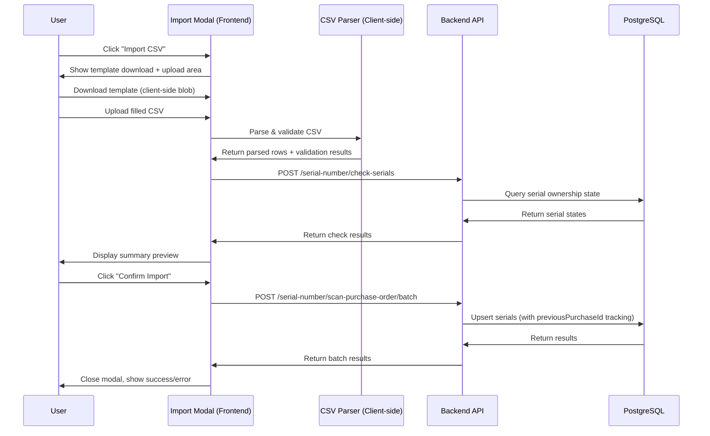
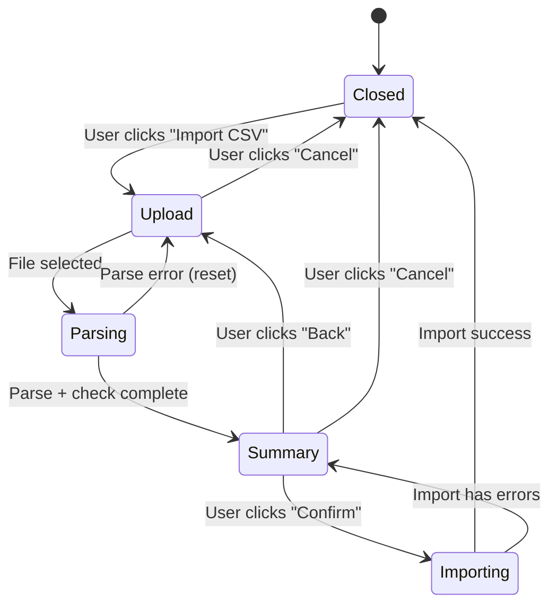

# Design Document: PO CSV Import Improvement

## Overview

This feature replaces the existing direct-file-picker CSV import flow on the Purchase Order edit form with a multi-step modal dialog. The improved flow provides a template download, file upload with client-side parsing and validation, a summary preview (including backend-verified reassignment info), and an explicit confirmation step before processing.

Additionally, a `previousPurchaseId` column is added to `tblserial_numbers` to preserve purchase history when serials are reassigned between POs via CSV import.

### Key Design Decisions

1. **Inline modal pattern** — The modal uses the same inline dialog state management pattern (`csvImportDialogMode`) already established in the component (e.g., `poGuardDialogMode`, `manualSerialDialogState`). No external dialog library is introduced.
2. **Client-side template generation** — The CSV template is generated as a Blob with UTF-8 BOM and downloaded via a temporary anchor element. No backend call needed.
3. **Client-side parsing + backend validation** — CSV parsing, normalization, deduplication, and basic validation happen client-side. A new backend endpoint checks serial ownership state for the summary preview.
4. **Minimal backend surface change** — Only one new endpoint (`POST /serial-number/check-serials`) is added. The existing `scanPurchaseOrderBatch` endpoint is reused for the actual import with a minor internal modification to track `previousPurchaseId`.
5. **Opt-in previousPurchaseId tracking** — The `previousPurchaseId` logic is triggered only during batch CSV import (via a flag on the DTO), not during individual serial scans, preserving backward compatibility.

## Architecture



### Modal State Machine



## Components and Interfaces

### Frontend Components

#### Import Modal State (in PurchaseOrderComponent)

```typescript
type CsvImportStep = 'upload' | 'summary' | 'importing';

interface CsvImportRow {
  serialNumber: string;
  unitType: string;
  status: 'valid' | 'invalid' | 'duplicate' | 'exists-current-po' | 'reassign';
  reason?: string;
  currentPoNumber?: string;
  currentPurchaseId?: number;
}

interface CsvImportState {
  step: CsvImportStep;
  file: File | null;
  rows: CsvImportRow[];
  totalCount: number;
  validCount: number;
  invalidCount: number;
  duplicateCount: number;
  existsCurrentPoCount: number;
  reassignCount: number;
  parseError: string | null;
  importError: string | null;
}
```

#### Template Download (client-side utility)

```typescript
downloadCsvTemplate(): void {
  const bom = '\uFEFF';
  const header = 'serialNumber,unitType\n';
  const blob = new Blob([bom + header], { type: 'text/csv;charset=utf-8;' });
  const url = URL.createObjectURL(blob);
  const anchor = document.createElement('a');
  anchor.href = url;
  anchor.download = 'serial_import_template.csv';
  anchor.click();
  URL.revokeObjectURL(url);
}
```

### Backend Interfaces

#### New Endpoint: Check Serials

**Route:** `POST /serial-number/check-serials`

**Request DTO:**

```typescript
export class CheckSerialsDto {
  serialNumbers!: string[];
  purchaseId!: number;
}
```

**Response:**

```typescript
interface CheckSerialsResponse {
  results: Array<{
    serialNumber: string;
    exists: boolean;
    currentPurchaseId: number | null;
    currentPoNumber: string | null;
    isSamePoAssignment: boolean;
  }>;
}
```

#### Modified Batch DTO (backward-compatible addition)

```typescript
export class ScanPurchaseOrderBatchDto {
  items!: ScanPurchaseOrderBatchItemDto[];
  trackPreviousPurchase?: boolean; // New optional field, defaults to false
}
```

### Service Layer Changes

The `scanPurchaseOrder` method receives an optional `trackPreviousPurchase` parameter. When `true` and the serial already has a `purchaseId` that differs from the new one, the service sets `previousPurchaseId = current purchaseId` before overwriting.

```typescript
// In scanPurchaseOrder, before the UPDATE:
if (trackPreviousPurchase && Number.isFinite(currentPurchaseId) && currentPurchaseId > 0 && currentPurchaseId !== purchaseId) {
  updateRecord['previousPurchaseId'] = currentPurchaseId;
}
```

The `scanPurchaseOrderBatch` method passes `dto.trackPreviousPurchase` through to each `scanPurchaseOrder` call.

## Data Models

### Database Schema Change

**Migration: Add `previousPurchaseId` to `tblserial_numbers`**

```sql
ALTER TABLE public.tblserial_numbers
  ADD COLUMN IF NOT EXISTS "previousPurchaseId" INTEGER NULL;

ALTER TABLE public.tblserial_numbers
  ADD CONSTRAINT tblserial_numbers_previousPurchaseId_fkey
  FOREIGN KEY ("previousPurchaseId")
  REFERENCES public.tblpurchase_orders(id)
  ON UPDATE CASCADE
  ON DELETE SET NULL;

CREATE INDEX IF NOT EXISTS idx_tblserial_numbers_previousPurchaseId
  ON public.tblserial_numbers("previousPurchaseId")
  WHERE "previousPurchaseId" IS NOT NULL;
```

### Updated Entity Model

```
tblserial_numbers
├── id (BIGINT, PK)
├── branchId (BIGINT, FK → tblbranches)
├── vendorId (UUID, FK → tblvendors)
├── purchaseId (INTEGER, FK → tblpurchase_orders)
├── previousPurchaseId (INTEGER, FK → tblpurchase_orders) ← NEW
├── salesId (BIGINT, FK → tblsales_order)
├── previousSalesId (BIGINT, FK → tblsales_order)
├── productId (BIGINT, FK → tblproducts)
├── capacityId (BIGINT, FK → tblcapacity)
├── serialNumber (VARCHAR, UNIQUE)
├── unitType (VARCHAR)
├── status (VARCHAR)
├── created_at (TIMESTAMPTZ)
├── created_by (BIGINT, FK → tblusers)
├── customerId (UUID, FK → tblcustomer)
├── isDefective (BOOLEAN)
├── isReturned (BOOLEAN)
├── defectReason (TEXT)
├── returnReason (TEXT)
├── defectDate (TIMESTAMPTZ)
└── returnDate (TIMESTAMPTZ)
```

### Check Serials Query

```sql
SELECT
  sn."serialNumber",
  sn."purchaseId",
  po."poNumber" AS "currentPoNumber"
FROM tblserial_numbers sn
LEFT JOIN tblpurchase_orders po ON po.id = sn."purchaseId"
WHERE LOWER(BTRIM(sn."serialNumber")) = ANY($1::text[])
```

The `$1` parameter is an array of lowercased, trimmed serial numbers. Results are mapped back to the original input for the response.


## Correctness Properties

*A property is a characteristic or behavior that should hold true across all valid executions of a system—essentially, a formal statement about what the system should do. Properties serve as the bridge between human-readable specifications and machine-verifiable correctness guarantees.*

### Property 1: CSV Header Validation

*For any* CSV string content, the parser SHALL reject (throw an error or return a validation failure) if and only if the header row does not contain both `serialNumber` and `unitType` columns (case-insensitive, allowing underscore variants).

**Validates: Requirements 3.2**

### Property 2: Normalization Idempotence

*For any* string input, applying `normalizeSerial` twice SHALL produce the same result as applying it once (i.e., `normalizeSerial(normalizeSerial(x)) === normalizeSerial(x)`). The same idempotence property SHALL hold for `normalizeUnitTypeLabel`.

**Validates: Requirements 3.4, 3.5**

### Property 3: Summary Count Partition Invariant

*For any* parsed CSV with N data rows, the summary counts SHALL satisfy: `validCount + invalidCount + duplicateCount === totalCount`, where `totalCount === N`. Every row is classified into exactly one of these three categories.

**Validates: Requirements 4.1, 4.2, 4.3**

### Property 4: Duplicate Detection Correctness

*For any* list of CSV rows after normalization, a row is marked as a duplicate if and only if another row with the same normalized serial number (case-insensitive) appears earlier in the list. The first occurrence is never marked as a duplicate.

**Validates: Requirements 4.4**

### Property 5: Serial Status Classification

*For any* valid parsed row and corresponding check-serials backend response, the row SHALL be classified as `exists-current-po` if `isSamePoAssignment === true`, as `reassign` if `exists === true && isSamePoAssignment === false`, and as `valid` if `exists === false`.

**Validates: Requirements 4.5, 4.6**

### Property 6: Previous Purchase ID Preservation

*For any* serial number being processed via CSV batch import with `trackPreviousPurchase = true`: if the serial has an existing non-null `purchaseId` that differs from the new PO, then `previousPurchaseId` SHALL be set to the old `purchaseId` value. If the serial has a null `purchaseId`, then `previousPurchaseId` SHALL remain null.

**Validates: Requirements 6.1, 6.2, 6.3**

### Property 7: Individual Scan Does Not Track Previous Purchase

*For any* serial number processed via the individual scan flow (non-batch, or batch with `trackPreviousPurchase` unset/false), the `previousPurchaseId` column SHALL NOT be modified regardless of the serial's current `purchaseId` state.

**Validates: Requirements 6.5, 7.3**

## Error Handling

### Frontend Error Handling

| Error Condition | Handling |
|---|---|
| File is not a CSV (wrong extension/MIME) | Display inline error in upload area, allow re-upload |
| CSV missing required headers | Display validation error with specific missing header names |
| CSV has zero data rows | Display "File is empty" error |
| All rows are invalid | Show summary with 0 valid rows, disable Confirm button |
| Network error during check-serials | Display error toast, allow retry |
| Network error during batch import | Display error in modal with retry option |
| Partial batch failure | Show modal with per-serial error details, close with partial success message |
| File too large (>10MB) | Reject with "File too large" message before parsing |

### Backend Error Handling

| Error Condition | Handling |
|---|---|
| `check-serials` called with empty array | Return 400 with "At least one serial number is required" |
| `check-serials` called with >5000 serials | Return 400 with "Maximum 5000 serial numbers per check" |
| Database connection failure | Return 500, log error, frontend shows generic error |
| `previousPurchaseId` column missing (pre-migration) | The `pickColumn` utility returns null, update skips the field gracefully |
| Concurrent modification (serial reassigned between check and import) | The existing `scanPurchaseOrder` logic handles this — returns failure for that serial |

### Error Recovery

- The modal preserves parsed state on import failure so users can retry without re-uploading
- Partial successes are reported with counts (X succeeded, Y failed)
- Failed serials are listed with individual reasons in the modal

## Testing Strategy

### Unit Tests (Frontend - Jasmine/Karma)

- Template download generates correct CSV content with BOM
- CSV parser handles: valid files, missing headers, empty files, quoted fields, BOM prefix
- Normalization functions produce expected output for known inputs
- Summary computation produces correct counts for various input combinations
- Modal state transitions work correctly
- Permission checks hide/show the Import CSV button
- Confirm button disabled when validCount is 0

### Unit Tests (Backend - Jest)

- `checkSerials` service method returns correct state for existing/non-existing serials
- `scanPurchaseOrder` with `trackPreviousPurchase=true` sets `previousPurchaseId` correctly
- `scanPurchaseOrder` with `trackPreviousPurchase=false` does not modify `previousPurchaseId`
- `scanPurchaseOrderBatch` passes `trackPreviousPurchase` flag through to individual calls
- Input validation on `CheckSerialsDto` (empty array, max size)

### Property-Based Tests (Backend - fast-check via Jest)

The backend logic for normalization, deduplication, and previousPurchaseId tracking is well-suited for property-based testing.

**Library:** `fast-check` (JavaScript/TypeScript PBT library)
**Minimum iterations:** 100 per property
**Tag format:** `Feature: po-csv-import-improvement, Property {number}: {property_text}`

Properties to implement:
- Property 2: Normalization idempotence (test `normalizeSerialNumber` and `normalizeUnitType`)
- Property 3: Summary count partition invariant (test the classification/counting logic)
- Property 4: Duplicate detection correctness
- Property 5: Serial status classification from check response
- Property 6: previousPurchaseId preservation logic
- Property 7: Individual scan does not track previous purchase

### Integration Tests

- End-to-end CSV import flow with test database
- Backward compatibility: existing batch payload format still works
- `check-serials` endpoint returns correct data for mixed serial states
- Migration applies cleanly and column has correct constraints
