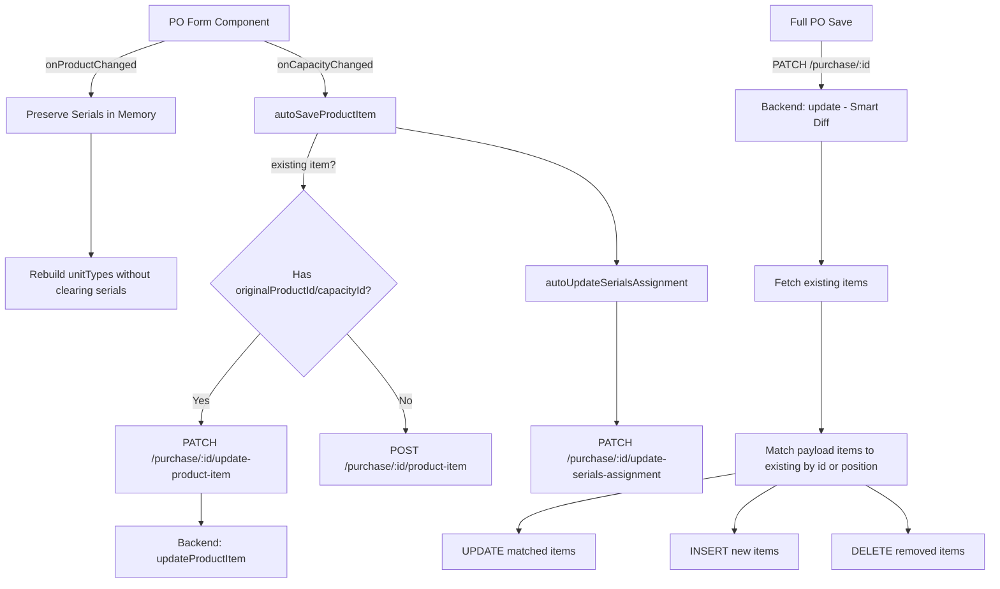

# Design Document: PO Product Item Edit Fix

## Overview

This design addresses two interconnected bugs in the Purchase Order product item editing workflow. When a user changes the product on an existing PO line item: (1) serial numbers visually disappear because `onProductChanged()` rebuilds `unitTypes` with empty serial arrays, and (2) the backend creates duplicate rows because `autoSaveProductItem()` always calls the INSERT endpoint and the bulk `update()` method does DELETE-all then re-INSERT.

The fix involves four coordinated changes: preserving serials in the frontend during product changes, deferring serial reassignment until capacity is selected, adding an UPDATE endpoint for single product items, and replacing the destructive DELETE-all pattern with a smart diff approach on the backend.

## Architecture



## Components and Interfaces

### Component 1: Frontend Serial Preservation (`onProductChanged`)

**Purpose**: Retain scanned serial numbers when the user changes the product selection, so they remain visible and can be reassigned once a new capacity is chosen.

**Current behavior**:
```typescript
// Rebuilds unitTypes with empty serials — data loss
nextUnitTypes = productUnitTypeLabels.map((label) => this.createUnitTypeEntry(label, 0, []));
```

**Fixed behavior**:
```typescript
// Before rebuilding, capture existing serials from old unitTypes
const preservedSerials: Record<string, string[]> = {};
if (this.drawerMode === 'edit' && currentItem.unitTypes) {
  for (const ut of currentItem.unitTypes) {
    if (ut.serials.length > 0) {
      preservedSerials[ut.label] = [...ut.serials];
    }
  }
}

// Store preserved serials on the item for later reassignment
nextItems[index] = {
  ...nextItems[index],
  capacityId: '',
  unitTypes: nextUnitTypes,
  _preservedSerials: preservedSerials,  // temporary field
  _originalProductId: oldProductId,      // track what we came from
  _originalCapacityId: oldCapacityId,    // track what we came from
};
```

**Interface change** — Add tracking fields to `PurchaseProductFormItem`:

```typescript
interface PurchaseProductFormItem {
  productId: string;
  capacityId: string;
  unitPrice: number;
  sellPrice: number | '';
  discountPrice: number | '';
  unitTypes: PurchaseUnitTypeFormItem[];
  totalSetQty: number;
  // New fields for edit-mode tracking
  _preservedSerials?: Record<string, string[]>;
  _originalProductId?: string;
  _originalCapacityId?: string;
}
```

### Component 2: Frontend Serial Reassignment (`onCapacityChanged`)

**Purpose**: After the user picks a new capacity, reassign preserved serials to the new unitTypes and trigger the backend serial update.

**Logic**:

```typescript
onCapacityChanged(index: number): void {
  const item = this.createForm.productItems[index];
  if (!item) return;

  // Reassign preserved serials to new unitTypes
  if (this.drawerMode === 'edit' && item._preservedSerials) {
    this.reassignPreservedSerials(index);
  }

  this.recalculateTotalAmount();

  if (this.drawerMode === 'edit' && this.editingPurchaseId) {
    const productId = Number(item.productId);
    const capacityId = Number(item.capacityId);
    if (Number.isFinite(productId) && productId > 0 && Number.isFinite(capacityId) && capacityId > 0) {
      void this.autoSaveProductItem(index);

      // Now trigger serial reassignment with old values
      const oldProductId = Number(item._originalProductId);
      const oldCapacityId = Number(item._originalCapacityId);
      if (Number.isFinite(oldProductId) && oldProductId > 0 &&
          Number.isFinite(oldCapacityId) && oldCapacityId > 0) {
        void this.autoUpdateSerialsAssignment(oldProductId, oldCapacityId, productId, capacityId);
        // Clear tracking fields after successful reassignment
        item._originalProductId = undefined;
        item._originalCapacityId = undefined;
        item._preservedSerials = undefined;
      }
    }
  }
}
```

**Serial redistribution** (`reassignPreservedSerials`):

```typescript
private reassignPreservedSerials(index: number): void {
  const item = this.createForm.productItems[index];
  if (!item?._preservedSerials) return;

  const allPreservedSerials: string[] = [];
  for (const serials of Object.values(item._preservedSerials)) {
    allPreservedSerials.push(...serials);
  }

  if (allPreservedSerials.length === 0) return;

  // Distribute to new unitTypes by matching labels first, then overflow to first
  const remaining = [...allPreservedSerials];
  for (const ut of item.unitTypes) {
    const matchingSerials = item._preservedSerials[ut.label];
    if (matchingSerials) {
      ut.serials = [...matchingSerials];
      ut.serialInput = matchingSerials.join('\n');
      // Remove from remaining
      for (const s of matchingSerials) {
        const idx = remaining.indexOf(s);
        if (idx >= 0) remaining.splice(idx, 1);
      }
    }
  }

  // Redistribute any remaining serials to the first unit type
  if (remaining.length > 0 && item.unitTypes.length > 0) {
    item.unitTypes[0].serials.push(...remaining);
    item.unitTypes[0].serialInput = item.unitTypes[0].serials.join('\n');
  }
}
```

### Component 3: Frontend `autoSaveProductItem` — UPDATE vs INSERT

**Purpose**: When editing an existing item, call the update endpoint instead of the add endpoint.

**Logic**:

```typescript
private async autoSaveProductItem(productIndex: number): Promise<void> {
  if (!this.editingPurchaseId) return;

  const item = this.createForm.productItems[productIndex];
  if (!item) return;

  const productId = Number(item.productId);
  const capacityId = Number(item.capacityId);
  if (!Number.isFinite(productId) || productId <= 0) return;
  if (!Number.isFinite(capacityId) || capacityId <= 0) return;

  try {
    const unitTypesQty = item.unitTypes.map((ut) => ({
      label: ut.label,
      value: Number(ut.value) || 0,
    }));

    const payload = {
      productId,
      capacityId,
      unitPrice: Number(item.unitPrice) || 0,
      sellPrice: Number(item.sellPrice) || 0,
      discountPrice: Number(item.discountPrice) || 0,
      totalSetQty: Number(item.totalSetQty) || 0,
      unitTypesQty,
    };

    const isExistingItem = !!(item._originalProductId && item._originalCapacityId);

    if (isExistingItem) {
      // UPDATE existing row identified by old product/capacity
      await this.purchaseOrderService.updateProductItem(this.editingPurchaseId, {
        ...payload,
        oldProductId: Number(item._originalProductId),
        oldCapacityId: Number(item._originalCapacityId),
      });
    } else {
      // INSERT new row (first time adding this item)
      await this.purchaseOrderService.addProductItem(this.editingPurchaseId, payload);
    }
  } catch {
    // Silent — product item will still be persisted on full Update PO
  }
}
```

**New frontend service method**:

```typescript
async updateProductItem(
  purchaseId: number,
  item: {
    oldProductId: number;
    oldCapacityId: number;
    productId: number;
    capacityId: number;
    unitPrice?: number;
    sellPrice?: number;
    discountPrice?: number;
    totalSetQty?: number;
    unitTypesQty?: Array<{ label: string; value: number }>;
  },
): Promise<{ success: boolean; message?: string }> {
  const response = await apiClient.patch<{ success: boolean; message?: string }>(
    `/purchase/${purchaseId}/update-product-item`,
    item,
  );
  return response.data;
}
```

### Component 4: Backend `updateProductItem` Endpoint

**Purpose**: Update an existing product item row by locating it via `purchaseId` + `oldProductId` + `oldCapacityId`, then updating all fields to the new values.

**Endpoint**: `PATCH /purchase/:id/update-product-item`

**Interface**:

```typescript
async updateProductItem(
  purchaseId: number,
  item: {
    oldProductId: number;
    oldCapacityId: number;
    productId: number;
    capacityId: number;
    unitPrice?: number;
    sellPrice?: number;
    discountPrice?: number;
    totalSetQty?: number;
    unitTypesQty?: Array<{ label: string; value: number }>;
  },
  userId?: number,
): Promise<{ success: boolean; message?: string }>
```

**Logic**:

```typescript
// 1. Validate inputs
// 2. Find existing row: WHERE purchaseId = $1 AND productId = $2 AND capacityId = $3 AND transType = 'purchase'
// 3. If not found: fall back to INSERT (treat as new item)
// 4. If found: UPDATE SET productId=$new, capacityId=$new, unitPrice, sellPrice, discountPrice, unitTypesQty, totalSetQty
```

**SQL pseudo-query**:

```sql
UPDATE tbltransaction_product_items
SET "productId" = $newProductId,
    "capacityId" = $newCapacityId,
    "unitPrice" = $unitPrice,
    "sellPrice" = $sellPrice,
    "discountPrice" = $discountPrice,
    "unitTypesQty" = $unitTypesQty,
    "totalSetQty" = $totalSetQty
WHERE "purchaseId"::text = $purchaseId
  AND "productId"::text = $oldProductId
  AND "capacityId"::text = $oldCapacityId
  AND LOWER(COALESCE("transType", 'purchase')) = 'purchase'
```

### Component 5: Backend `update()` — Smart Diff Instead of DELETE-all

**Purpose**: Replace the destructive DELETE-all-then-INSERT pattern in the `update()` method with an incremental approach that preserves existing row IDs.

**Current behavior**:
```sql
DELETE FROM tbltransaction_product_items WHERE purchaseId = $1 AND transType = 'purchase';
-- Then INSERT all items from payload
```

**New behavior**:

```typescript
// 1. Fetch existing items for this PO
const existingItems = await client.query(
  `SELECT id, "productId", "capacityId" FROM tbltransaction_product_items
   WHERE "purchaseId"::text = $1 AND LOWER(COALESCE("transType", 'purchase')) = 'purchase'`,
  [String(id)]
);

// 2. Match payload items to existing rows by (productId, capacityId)
//    or by position if no exact match found
const matched: Map<existingRowId, payloadItem> = matchItems(existingItems, payloadItems);

// 3. UPDATE matched items
for (const [existingId, payloadItem] of matched) {
  await client.query(
    `UPDATE tbltransaction_product_items SET ... WHERE id = $1`,
    [existingId, ...values]
  );
}

// 4. INSERT unmatched payload items (genuinely new)
for (const newItem of unmatched) {
  await this.runInsert(client, 'tbltransaction_product_items', record);
}

// 5. DELETE existing items that have no matching payload item
for (const removedId of existingNotInPayload) {
  await client.query(
    `DELETE FROM tbltransaction_product_items WHERE id = $1`,
    [removedId]
  );
}
```

**Matching algorithm**:

```typescript
function matchItems(existing, payload): { updates, inserts, deletes } {
  const updates = [];
  const usedExistingIds = new Set<number>();

  // Pass 1: Exact match by (productId, capacityId)
  for (const payloadItem of payload) {
    const match = existing.find(e =>
      String(e.productId) === String(payloadItem.productId) &&
      String(e.capacityId) === String(payloadItem.capacityId) &&
      !usedExistingIds.has(e.id)
    );
    if (match) {
      updates.push({ existingId: match.id, payloadItem });
      usedExistingIds.add(match.id);
    }
  }

  // Pass 2: Remaining payload items without a match → INSERT
  const inserts = payload.filter(p =>
    !updates.some(u => u.payloadItem === p)
  );

  // Pass 3: Existing items not matched → DELETE
  const deletes = existing
    .filter(e => !usedExistingIds.has(e.id))
    .map(e => e.id);

  return { updates, inserts, deletes };
}
```

## Data Models

### PurchaseProductFormItem (Frontend — extended)

```typescript
interface PurchaseProductFormItem {
  productId: string;
  capacityId: string;
  unitPrice: number;
  sellPrice: number | '';
  discountPrice: number | '';
  unitTypes: PurchaseUnitTypeFormItem[];
  totalSetQty: number;
  // Edit-mode tracking (transient, not persisted)
  _preservedSerials?: Record<string, string[]>;
  _originalProductId?: string;
  _originalCapacityId?: string;
}
```

### UpdateProductItemDto (Backend)

```typescript
{
  oldProductId: number;    // identifies existing row
  oldCapacityId: number;   // identifies existing row
  productId: number;       // new value
  capacityId: number;      // new value
  unitPrice?: number;
  sellPrice?: number;
  discountPrice?: number;
  totalSetQty?: number;
  unitTypesQty?: Array<{ label: string; value: number }>;
}
```

## Error Handling

### Scenario 1: Update target row not found

**Condition**: `updateProductItem` is called but no row matches `(purchaseId, oldProductId, oldCapacityId)`
**Response**: Fall back to INSERT behavior — create a new row with the provided values
**Recovery**: The item will exist in the database regardless of whether it was an update or insert

### Scenario 2: Serial reassignment fails

**Condition**: The `autoUpdateSerialsAssignment` call returns an error or network failure
**Response**: The PO_Form displays a toast notification with the error message. Serials remain in the UI (preserved in `unitTypes.serials`) so the user can manually resolve.
**Recovery**: On full PO save, serials are included in the payload and will be reconciled

### Scenario 3: Concurrent edit conflict

**Condition**: Two users editing the same PO simultaneously, both changing the same product item
**Response**: The last write wins (standard optimistic concurrency). The smart diff uses row `id` for matching, so both writes target the same row.
**Recovery**: No explicit conflict resolution needed — the full PO save overwrites with current state

## Correctness Properties

*A property is a characteristic or behavior that should hold true across all valid executions of a system — essentially, a formal statement about what the system should do. Properties serve as the bridge between human-readable specifications and machine-verifiable correctness guarantees.*

### Property 1: Serial preservation round-trip

*For any* product item with N total serial numbers across all unit types, changing the product and then selecting a new capacity SHALL result in exactly N serial numbers being present across the new unit types (no serials lost, no serials duplicated).

**Validates: Requirements 1.1, 1.2, 1.3**

### Property 2: Smart diff idempotence

*For any* PO update payload that is identical to the current database state, the smart diff algorithm SHALL produce zero INSERTs, zero DELETEs, and only UPDATEs (which are effectively no-ops), leaving row IDs unchanged.

**Validates: Requirements 2.1, 2.3**

### Property 3: Update-or-insert completeness

*For any* product item auto-save where the item has `_originalProductId` and `_originalCapacityId` set, the system SHALL call the update endpoint; and for any item without those fields, the system SHALL call the insert endpoint. In both cases exactly one row in `tbltransaction_product_items` corresponds to the item after the operation.

**Validates: Requirements 3.1, 3.2, 3.3**

### Property 4: Serial reassignment consistency

*For any* product/capacity change on a PO line item with existing serials, after `autoUpdateSerialsAssignment` completes, all serial numbers in `tblserial_numbers` that previously pointed to `(purchaseId, oldProductId, oldCapacityId)` SHALL now point to `(purchaseId, newProductId, newCapacityId)`.

**Validates: Requirements 4.1, 4.2**

### Property 5: No orphaned product items after smart diff

*For any* PO update, the set of rows in `tbltransaction_product_items` for that purchaseId after the operation SHALL exactly equal the set of product items in the submitted payload (same count, same productId/capacityId pairs).

**Validates: Requirements 2.1, 2.2**

## Testing Strategy

### Unit Testing Approach

- Test `reassignPreservedSerials` with various scenarios: matching labels, non-matching labels, overflow redistribution
- Test the item matching algorithm (`matchItems`) with exact matches, partial matches, and pure inserts/deletes
- Test `autoSaveProductItem` routing logic: verify it calls UPDATE when `_originalProductId` is set, INSERT otherwise

### Integration Testing Approach

- Test the full `PATCH /purchase/:id` endpoint with a payload that modifies one item, adds one, and removes one — verify resulting rows
- Test `PATCH /purchase/:id/update-product-item` endpoint — verify row is updated in place (same id, new values)
- Test serial reassignment end-to-end: change product+capacity, verify `tblserial_numbers` rows updated

## Dependencies

- Existing `purchase.service.ts` methods: `updateSerialsAssignment`, `addProductItem`, `removeProductItem`
- Existing frontend service: `purchase-order.service.ts` with `addProductItem`, `updateSerialsAssignment`
- Database tables: `tbltransaction_product_items`, `tblserial_numbers`
- NestJS controller: `purchase.controller.ts` — needs new route registration
