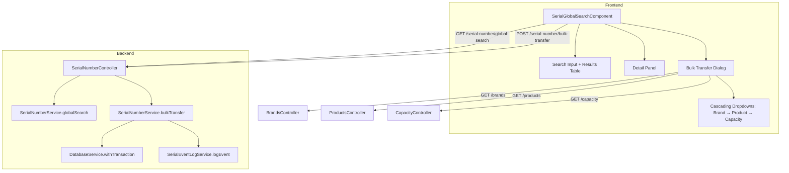

# Design Document: Serial Number Global Search & Bulk Transfer

## Overview

This feature adds two capabilities to the Inventory admin section:

1. **Global Serial Number Search** — A search interface that queries `tblserial_numbers` with joins to related tables (products, brands, capacities, branches, purchase orders, sales orders, customers) and returns paginated results with full details. A detail panel shows all fields plus the complete event history from `tblserial_number_events`.

2. **Bulk Transfer** — A multi-select + cascading-dropdown workflow that reassigns selected serial numbers to a different product and capacity. The operation runs in a single database transaction, validates targets, and logs `TRANSFERRED` events via the existing `SerialEventLogService`.

Both features are exposed through the existing `SerialNumberController` (backend) and a new standalone Angular component (frontend) routed under the Inventory section.

## Architecture



### Key Design Decisions

1. **Extend existing controller** rather than creating a new one — the `SerialNumberController` already handles serial operations and has the `JwtAuthGuard` and audit actor resolution in place.

2. **Raw SQL with joins** for the global search — consistent with the project's pattern of using `DatabaseService.query()` with parameterized SQL. No ORM.

3. **`DatabaseService.withTransaction()`** for bulk transfer — ensures atomicity. The existing helper handles BEGIN/COMMIT/ROLLBACK.

4. **Reuse existing brand/product/capacity endpoints** for cascading dropdowns — `GET /brands`, `GET /products`, and `GET /capacity` already exist. The frontend will filter products by `brandId` client-side (products already include `brandId`), and capacities by `prodId` client-side (capacities include `prodId`). This avoids new backend endpoints for filtering.

5. **Standalone Angular component** with signals — consistent with Angular 17+ patterns used in the project.

## Components and Interfaces

### Backend

#### New Methods on `SerialNumberService`

```typescript
// Global search with pagination
async globalSearch(params: {
  search: string;
  page: number;
  pageSize: number;
}): Promise<{
  success: boolean;
  items: GlobalSearchResult[];
  total: number;
  page: number;
  pageSize: number;
}>

// Bulk transfer
async bulkTransfer(params: {
  serialIds: number[];
  targetProductId: number;
  targetCapacityId: number;
  reason?: string;
  performedBy: number | null;
  performedByUsername: string | null;
  ipAddress: string | null;
}): Promise<{
  success: boolean;
  message: string;
  transferredCount?: number;
}>
```

#### New Controller Endpoints

```typescript
@Get('global-search')
globalSearch(
  @Query('search') search: string,
  @Query('page') page: string,
  @Query('pageSize') pageSize: string,
): Promise<GlobalSearchResponse>

@Post('bulk-transfer')
bulkTransfer(
  @Body() body: BulkTransferDto,
  @Req() request: AuthenticatedRequest,
): Promise<BulkTransferResponse>
```

#### DTOs

```typescript
// bulk-transfer.dto.ts
export class BulkTransferDto {
  serialIds: number[];
  targetProductId: number;
  targetCapacityId: number;
  reason?: string;
}
```

#### Response Interfaces

```typescript
interface GlobalSearchResult {
  id: number;
  serialNumber: string;
  status: string | null;
  unitType: string | null;
  brandName: string | null;
  productName: string | null;
  capacity: string | null;
  branchName: string | null;
  poNumber: string | null;
  soNumber: string | null;
  customerName: string | null;
  isDefective: boolean;
  isReturned: boolean;
  createdAt: string;
}
```

### Frontend

#### `SerialGlobalSearchComponent`

A standalone component at `frontend/src/app/pages/inventory/serial-global-search/`.

**State (signals):**
- `searchQuery: signal<string>('')`
- `results: signal<GlobalSearchResult[]>([])`
- `totalResults: signal<number>(0)`
- `currentPage: signal<number>(1)`
- `pageSize: signal<number>(20)`
- `selectedIds: signal<Set<number>>(new Set())`
- `detailSerial: signal<GlobalSearchResult | null>(null)`
- `eventHistory: signal<SerialEvent[]>([])`
- `isTransferDialogOpen: signal<boolean>(false)`
- `isLoading: signal<boolean>(false)`

**Transfer dialog state:**
- `brands: signal<Brand[]>([])`
- `products: signal<Product[]>([])`
- `capacities: signal<Capacity[]>([])`
- `selectedBrandId: signal<number | null>(null)`
- `selectedProductId: signal<number | null>(null)`
- `selectedCapacityId: signal<number | null>(null)`
- `transferReason: signal<string>('')`

#### Routing

Add route to `frontend/src/app/app.routes.ts`:
```typescript
{
  path: 'inventory/serial-global-search',
  loadComponent: () => import('./pages/inventory/serial-global-search/serial-global-search.component')
    .then(m => m.SerialGlobalSearchComponent)
}
```

## Data Models

### Global Search SQL Query

```sql
SELECT
  sn.id,
  sn."serialNumber",
  sn.status,
  sn."unitType",
  b."brandName",
  p."productName",
  c.capacity,
  br."branchName",
  po.po_number AS "poNumber",
  so.so_number AS "soNumber",
  cust.name AS "customerName",
  COALESCE(sn."isDefective", false) AS "isDefective",
  COALESCE(sn."isReturned", false) AS "isReturned",
  sn.created_at AS "createdAt"
FROM tblserial_numbers sn
LEFT JOIN tblproducts p ON p.id = sn."productId"
LEFT JOIN tblbrands b ON b.id = p."brandId"
LEFT JOIN tblcapacity c ON c.id = sn."capacityId"
LEFT JOIN tblbranches br ON br.id = sn."branchId"
LEFT JOIN tblpurchase_orders po ON po.id = sn."purchaseId"
LEFT JOIN tblsales_order so ON so.id = sn."salesId"
LEFT JOIN tblcustomer cust ON cust.id = sn."customerId"
WHERE sn."serialNumber" ILIKE $1
ORDER BY sn.created_at DESC
LIMIT $2 OFFSET $3
```

Count query (same WHERE, no LIMIT/OFFSET):
```sql
SELECT COUNT(*) AS total
FROM tblserial_numbers sn
WHERE sn."serialNumber" ILIKE $1
```

The `$1` parameter is `%${search}%` for partial matching.

### Bulk Transfer SQL

Within a transaction:

```sql
-- For each serial in the batch:
UPDATE tblserial_numbers
SET "productId" = $1, "capacityId" = $2
WHERE id = $3
RETURNING id, "serialNumber", "productId" AS "previousProductId", "capacityId" AS "previousCapacityId"
```

Note: To capture previous values, the service will first SELECT the current state before updating, or use a CTE:

```sql
UPDATE tblserial_numbers
SET "productId" = $1, "capacityId" = $2
WHERE id = ANY($3::bigint[])
RETURNING id, "serialNumber"
```

The previous values are fetched before the update in a single SELECT:
```sql
SELECT id, "serialNumber", "productId", "capacityId"
FROM tblserial_numbers
WHERE id = ANY($1::bigint[])
```

### Validation Queries

```sql
-- Verify product exists
SELECT id FROM tblproducts WHERE id = $1

-- Verify capacity exists and belongs to product
SELECT id FROM tblcapacity WHERE id = $1 AND "prodId" = $2
```

## Correctness Properties

*A property is a characteristic or behavior that should hold true across all valid executions of a system — essentially, a formal statement about what the system should do. Properties serve as the bridge between human-readable specifications and machine-verifiable correctness guarantees.*

### Property 1: Search returns all and only matching serials

*For any* set of serial numbers in the database and any search string of length ≥ 2, the global search SHALL return exactly those serials whose `serialNumber` field contains the search string as a case-insensitive substring, and no others.

**Validates: Requirements 1.1**

### Property 2: Pagination returns correct slices

*For any* total result set of size N, page number P (≥ 1), and page size S (≥ 1), the returned items SHALL be the slice from index `(P-1)*S` to `min(P*S, N) - 1` of the full ordered result set, and the returned `total` SHALL equal N.

**Validates: Requirements 1.4**

### Property 3: Event history is ordered by timestamp descending

*For any* serial number with event history, the returned events SHALL be ordered such that for every consecutive pair (event[i], event[i+1]), `event[i].createdAt >= event[i+1].createdAt`.

**Validates: Requirements 2.2**

### Property 4: Bulk transfer updates all targeted serials correctly

*For any* valid set of serial IDs and a valid target product/capacity pair, after a successful bulk transfer, every serial in the set SHALL have its `productId` equal to the target product ID and its `capacityId` equal to the target capacity ID.

**Validates: Requirements 4.4**

### Property 5: Bulk transfer is atomic

*For any* bulk transfer request, either ALL serial numbers in the batch are updated to the new product/capacity, or NONE are updated (the database state is unchanged from before the request).

**Validates: Requirements 4.5, 4.6**

### Property 6: Transfer event logging is complete and accurate

*For any* successful bulk transfer of N serial numbers, exactly N event log entries with event type `TRANSFERRED` SHALL be created, and each entry SHALL contain: the correct previous product ID, previous capacity ID, new product ID, new capacity ID, the performing user's ID, username, and IP address.

**Validates: Requirements 5.1, 5.2, 5.3**

### Property 7: Transfer validation rejects invalid targets

*For any* bulk transfer request where the target product ID does not exist in `tblproducts`, OR the target capacity ID does not exist in `tblcapacity`, OR the target capacity's `prodId` does not match the target product ID, the transfer SHALL be rejected and no serial numbers SHALL be modified.

**Validates: Requirements 6.1, 6.2, 6.3, 6.4**

## Error Handling

| Scenario | Backend Response | Frontend Behavior |
|----------|-----------------|-------------------|
| Search query < 2 chars | N/A (frontend validates) | Show validation message, don't call API |
| Search returns 0 results | `{ success: true, items: [], total: 0 }` | Display "No results found" message |
| Invalid page/pageSize params | Default to page=1, pageSize=20 | N/A |
| Empty serialIds in transfer | `400 { success: false, message: "..." }` | Show error toast |
| Target product not found | `400 { success: false, message: "Target product does not exist" }` | Show error toast |
| Target capacity not found | `400 { success: false, message: "Target capacity does not exist" }` | Show error toast |
| Capacity/product mismatch | `400 { success: false, message: "Target capacity does not belong to the selected product" }` | Show error toast |
| Transaction failure (DB error) | `500 { success: false, message: "Transfer failed: ..." }` | Show error toast, selection preserved |
| Network error | N/A | Show generic error toast, retry option |
| Unauthorized (JWT expired) | `401` | Redirect to login |

### Error Handling Strategy

- **Backend**: Use try/catch around `DatabaseService.withTransaction()`. On failure, the transaction is automatically rolled back. Return structured error responses with `success: false` and descriptive messages.
- **Frontend**: Display errors via toast notifications. Preserve selection state on failure so the user can retry without re-selecting.

## Testing Strategy

### Unit Tests (Example-Based)

- **Backend**:
  - `globalSearch` returns correct shape with all joined fields populated
  - `globalSearch` with no matches returns empty array and total=0
  - `bulkTransfer` returns success message with correct count
  - `bulkTransfer` with empty serialIds returns validation error
  - Confirmation that default reason is applied when none provided

- **Frontend**:
  - Component renders search input and results table
  - Select All checkbox selects all items on current page
  - Transfer button disabled when no selection
  - Confirmation dialog shows correct count and target details
  - Cancel dialog preserves selection state

### Property-Based Tests

Property-based testing is appropriate for this feature because the core logic involves:
- Search/filter operations with varying inputs (serial numbers, search terms)
- Pagination slicing with varying parameters
- Batch operations with varying batch sizes
- Validation logic with varying valid/invalid inputs

**Library**: [fast-check](https://github.com/dubzzz/fast-check) (already standard for TypeScript PBT)

**Configuration**: Minimum 100 iterations per property test.

**Tag format**: `Feature: serial-number-global-search, Property {number}: {property_text}`

| Property | Test Description | Key Generators |
|----------|-----------------|----------------|
| 1 | Search correctness | Random serial numbers, random substrings |
| 2 | Pagination slicing | Random total counts, page numbers, page sizes |
| 3 | Event history ordering | Random event timestamps |
| 4 | Transfer updates fields | Random serial IDs, valid product/capacity pairs |
| 5 | Transaction atomicity | Random batches with injected failures |
| 6 | Event logging completeness | Random batch sizes, user contexts |
| 7 | Validation rejects invalid targets | Random non-existent IDs, mismatched pairs |

### Integration Tests

- End-to-end search with real database (seeded test data)
- End-to-end bulk transfer with real database verifying rollback on failure
- Cascading dropdown data loading from existing endpoints
