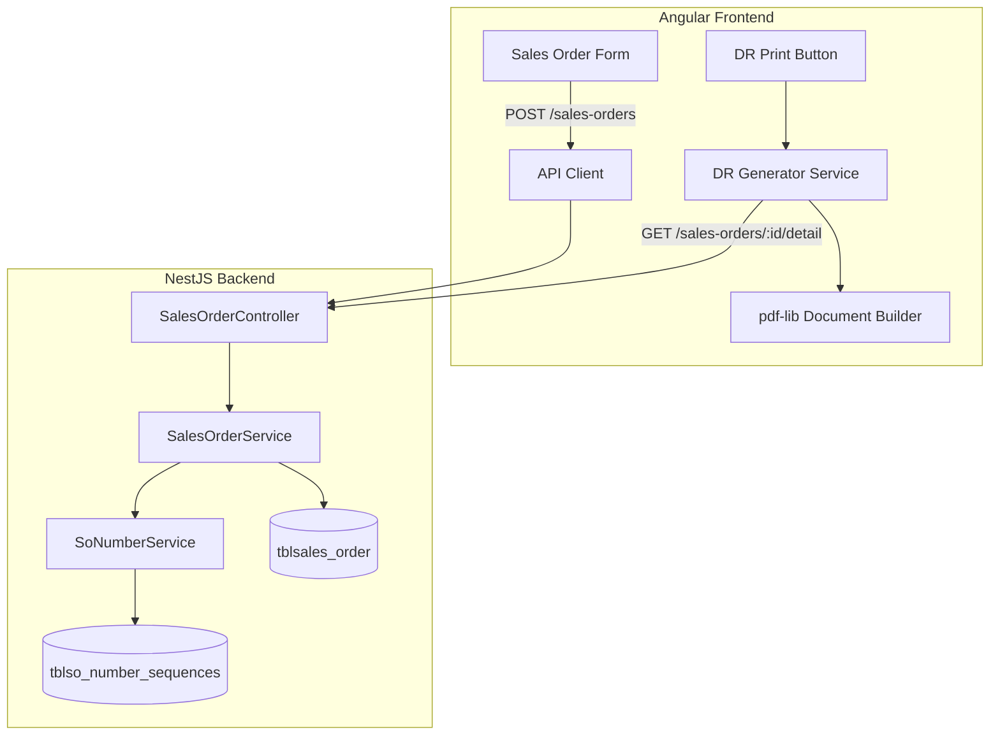
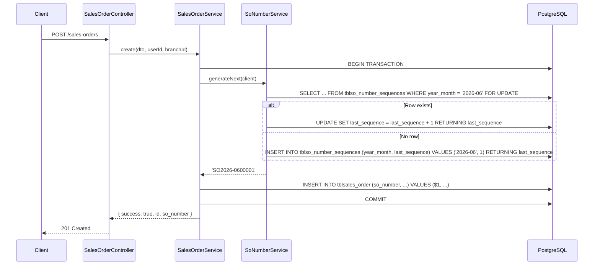
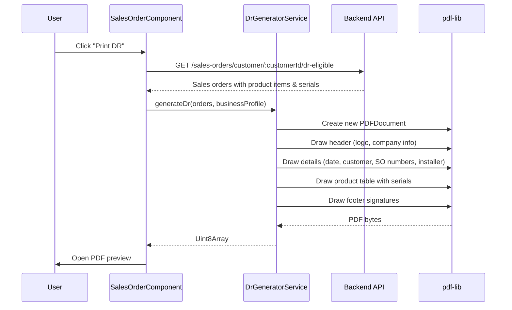
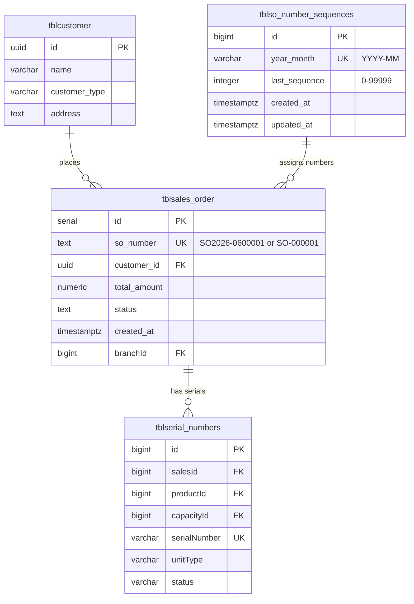

# Design Document: SO Number & DR Redesign

## Overview

This design addresses two interrelated changes to the HVAC Warehouse & Sales system:

1. **SO Number Format Redesign** — Migrate the `so_number` column from a PostgreSQL `GENERATED ALWAYS AS STORED` computed column (format `SO-000001`) to a regular `TEXT` column with application-level generation in the new format `SO<YEAR>-<MONTH><5-DIGIT-SEQ>` (e.g., `SO2026-0600001`). A dedicated sequence tracking table ensures concurrency-safe, gap-free numbering that resets monthly.

2. **Delivery Receipt (DR) PDF Redesign** — A new frontend code path that generates DR documents from scratch using `pdf-lib`, replacing the template overlay approach. The new DR groups multiple sales orders by customer and functions as the Master List for Installers.

### Design Decisions & Rationale

| Decision | Choice | Rationale |
|----------|--------|-----------|
| SO number generation location | Application-level (NestJS service) with `SELECT ... FOR UPDATE` row locking | Keeps logic testable, avoids complex PostgreSQL trigger maintenance, uses existing transaction pattern |
| Sequence storage | Dedicated `tblso_number_sequences` table | Cleanly separates concerns, enables easy monitoring, supports `FOR UPDATE` locking |
| DR PDF approach | Client-side `pdf-lib` from scratch | Aligns with existing frontend PDF pattern, no backend PDF service needed, full layout control |
| Existing DR code | Preserved as separate code path | Requirement 5.4 mandates backwards compatibility |
| Column migration | Two-step ALTER (drop generated, add constraints) | PostgreSQL requires dropping GENERATED before adding DEFAULT; preserves existing data |

## Architecture

### High-Level System Flow



### SO Number Generation Flow



### DR PDF Generation Flow



## Components and Interfaces

### Backend Components

#### 1. SoNumberService (NEW)

**File:** `backend/src/sales/sales-order/so-number.service.ts`

```typescript
@Injectable()
export class SoNumberService {
  constructor(private readonly databaseService: DatabaseService) {}

  /**
   * Generates the next SO number within a transaction.
   * Uses SELECT FOR UPDATE to prevent concurrent duplicates.
   * @param client - The active PoolClient (must be within a transaction)
   * @param createdAt - Optional timestamp override for year-month derivation (defaults to NOW)
   * @returns The formatted SO number string (e.g., 'SO2026-0600001')
   * @throws Error if monthly sequence exceeds 99999
   */
  async generateNext(client: PoolClient, createdAt?: Date): Promise<string>;

  /**
   * Formats a sequence number into the SO number string.
   * @param year - 4-digit year
   * @param month - 2-digit month (zero-padded)
   * @param sequence - Sequence number (1-99999)
   * @returns Formatted SO number
   */
  formatSoNumber(year: number, month: number, sequence: number): string;
}
```

#### 2. SalesOrderService (MODIFIED)

Changes to `create()` method:
- Remove conditional `so_number` assignment from payload
- Always call `SoNumberService.generateNext(client)` to obtain the SO number
- Pass the generated SO number into the INSERT statement

#### 3. SalesOrderController (MODIFIED)

New endpoint for DR-eligible orders:
```typescript
@Get('customer/:customerId/dr-eligible')
getDrEligibleOrders(
  @Param('customerId') customerId: string,
  @Query('branchId') branchId?: string,
): Promise<{ success: boolean; items: SalesOrderWithSerials[] }>;
```

### Frontend Components

#### 4. DrGeneratorService (NEW)

**File:** `frontend/src/app/shared/services/dr-generator.service.ts`

```typescript
@Injectable({ providedIn: 'root' })
export class DrGeneratorService {
  /**
   * Generates a DR PDF from scratch for one or more sales orders belonging to the same customer.
   */
  async generateDr(
    orders: DrEligibleOrder[],
    businessProfile: BusinessProfileSettings | null,
  ): Promise<Uint8Array>;

  /** Renders the header section (logo, company name, address) */
  private drawHeader(page: PDFPage, profile: BusinessProfileSettings | null, fonts: DrFonts): number;

  /** Renders the details section (date, customer, SOs, installer) */
  private drawDetails(page: PDFPage, orders: DrEligibleOrder[], y: number, fonts: DrFonts): number;

  /** Renders the product/serial table */
  private drawProductTable(page: PDFPage, orders: DrEligibleOrder[], y: number, fonts: DrFonts): number;

  /** Renders the 5 signature lines in the footer */
  private drawSignatures(page: PDFPage, y: number, fonts: DrFonts): void;
}
```

#### 5. SalesOrderComponent (MODIFIED)

- Add new `printNewDeliveryReceipt()` method that calls `DrGeneratorService`
- Keep existing `printDeliveryReceipt()` as the legacy template overlay path
- Add UI toggle or separate button for new DR generation

### Interfaces

```typescript
// Shared types for DR generation
interface DrEligibleOrder {
  id: number;
  soNumber: string;
  customerName: string;
  customerAddress: string;
  customerType: 'regular' | 'sub_dealer';
  installer: string | null;
  scheduleDate: string | null;
  productItems: DrProductItem[];
}

interface DrProductItem {
  productName: string;
  capacityName: string;
  sellPrice: number;
  serialNumbers: DrSerialEntry[];
}

interface DrSerialEntry {
  serialNumber: string;
  unitType: 'indoor' | 'outdoor' | 'window';
}

interface DrFonts {
  regular: PDFFont;
  bold: PDFFont;
  italic: PDFFont;
}
```

## Data Models

### New Table: `tblso_number_sequences`

Tracks the last-used sequence number per year-month combination.

```sql
CREATE TABLE IF NOT EXISTS public.tblso_number_sequences (
  id BIGINT GENERATED BY DEFAULT AS IDENTITY PRIMARY KEY,
  year_month VARCHAR(7) NOT NULL,  -- Format: 'YYYY-MM' (e.g., '2026-06')
  last_sequence INTEGER NOT NULL DEFAULT 0,
  created_at TIMESTAMPTZ NOT NULL DEFAULT NOW(),
  updated_at TIMESTAMPTZ NOT NULL DEFAULT NOW(),
  CONSTRAINT uq_so_sequences_year_month UNIQUE (year_month),
  CONSTRAINT chk_sequence_range CHECK (last_sequence >= 0 AND last_sequence <= 99999)
);

CREATE INDEX IF NOT EXISTS idx_so_sequences_year_month ON public.tblso_number_sequences(year_month);
```

### Migration: `tblsales_order.so_number` Column

```sql
-- Step 1: Drop the GENERATED ALWAYS column and recreate as regular TEXT
-- PostgreSQL does not allow ALTER COLUMN to drop generation expression directly,
-- so we use a two-step approach.

-- 1a. Add a temporary column to hold existing values
ALTER TABLE public.tblsales_order ADD COLUMN so_number_new TEXT;

-- 1b. Copy existing generated values into the new column
UPDATE public.tblsales_order SET so_number_new = so_number;

-- 1c. Drop the generated column
ALTER TABLE public.tblsales_order DROP COLUMN so_number;

-- 1d. Rename the new column
ALTER TABLE public.tblsales_order RENAME COLUMN so_number_new TO so_number;

-- Step 2: Add constraints
ALTER TABLE public.tblsales_order ALTER COLUMN so_number SET NOT NULL;
ALTER TABLE public.tblsales_order ADD CONSTRAINT uq_sales_order_so_number UNIQUE (so_number);

-- Step 3: Seed the sequence table with the current month's count
-- (Run after migration during deployment)
INSERT INTO public.tblso_number_sequences (year_month, last_sequence)
SELECT
  TO_CHAR(NOW(), 'YYYY-MM'),
  COALESCE(COUNT(*), 0)
FROM public.tblsales_order
WHERE created_at >= DATE_TRUNC('month', NOW())
ON CONFLICT (year_month) DO UPDATE SET last_sequence = EXCLUDED.last_sequence;
```

### Entity Relationships



## Correctness Properties

*A property is a characteristic or behavior that should hold true across all valid executions of a system — essentially, a formal statement about what the system should do. Properties serve as the bridge between human-readable specifications and machine-verifiable correctness guarantees.*

### Property 1: SO Number Format Validity

*For any* valid year (2000–2099), month (1–12), and sequence number (1–99999), the `formatSoNumber` function SHALL produce a string matching the pattern `SO<4-digit-year>-<2-digit-month><5-digit-sequence>` where month and sequence are zero-padded.

**Validates: Requirements 1.1, 3.3**

### Property 2: Timestamp-to-Components Extraction

*For any* valid Date timestamp, the SO number generator SHALL extract the year and month components such that the generated SO number contains exactly the 4-digit year and 2-digit month from that timestamp.

**Validates: Requirements 1.2**

### Property 3: Monthly Sequence Initialization

*For any* year-month combination that has no prior sequence record in `tblso_number_sequences`, the first generated SO number for that month SHALL have a sequence component of `00001`.

**Validates: Requirements 1.3, 3.2**

### Property 4: Sequential Increment Invariant

*For any* N consecutive calls to `generateNext` within the same year-month (in a serialized execution), the generated sequence numbers SHALL be consecutive integers: if the k-th call produces sequence S, the (k+1)-th call SHALL produce sequence S+1.

**Validates: Requirements 1.4**

### Property 5: Month Isolation

*For any* two distinct year-month combinations, generating SO numbers in one month SHALL NOT affect the sequence counter of the other month. Each month's counter is independently tracked.

**Validates: Requirements 3.1**

### Property 6: SO Number Search Matches Both Formats

*For any* valid SO number in either the old format (`SO-XXXXXX`) or new format (`SO<YEAR>-<MONTH><SEQ>`), the search/filter function SHALL return a match when queried with that SO number string.

**Validates: Requirements 4.3**

### Property 7: DR Customer Grouping

*For any* set of DR-eligible sales orders belonging to the same customer, the DR generator SHALL include all of those orders in a single Delivery Receipt document (one PDF).

**Validates: Requirements 5.2**

### Property 8: Sub-Dealer Label Rendering

*For any* sales order where the customer type is `"sub_dealer"`, the DR generator SHALL use the label "Sub Dealer" for the customer name field instead of "Customer".

**Validates: Requirements 7.6**

### Property 9: Product Description Concatenation

*For any* product item with a product name and capacity name, the DR table description column SHALL contain the concatenation of product name and capacity name.

**Validates: Requirements 8.2**

### Property 10: Serial Type Filtering

*For any* product item with a set of serial number records, the Indoor Serial column SHALL contain only serials where `unitType = "indoor"` (or "window"), and the Outdoor Serial column SHALL contain only serials where `unitType = "outdoor"`. No serial shall appear in the wrong column.

**Validates: Requirements 8.3, 8.4**

### Property 11: Table Row Count Equals Serial Combinations

*For any* sales order with product items, the number of rows rendered in the DR body table SHALL equal the total count of product-capacity-serial combinations across all items in the order.

**Validates: Requirements 8.5**

### Property 12: DR Eligibility Status Filter

*For any* sales order, the DR print action SHALL be enabled if and only if the order's normalized status is one of {"for-delivery", "remitted", "complete", "released"}. Orders with any other status SHALL be excluded from DR generation.

**Validates: Requirements 10.1, 10.2, 10.3**

## Error Handling

### SO Number Generation Errors

| Scenario | Handling | User Impact |
|----------|----------|-------------|
| Monthly sequence overflow (> 99999) | `SoNumberService.generateNext()` throws `BadRequestException` with message "Monthly SO number limit (99999) reached for {YYYY-MM}" | Transaction rolls back, API returns 400 |
| Database lock timeout (FOR UPDATE) | Standard PostgreSQL timeout → transaction rollback | API returns 500, client can retry |
| Invalid date/timestamp | Guard clause in `generateNext` validates input before querying | API returns 400 with validation message |
| Sequence table unavailable | Query failure caught by transaction, rollback | API returns 500 with generic error |

### DR PDF Generation Errors

| Scenario | Handling | User Impact |
|----------|----------|-------------|
| No eligible orders found | Return empty result with message | UI shows "No orders eligible for DR" |
| Business logo URL unreachable | Skip logo gracefully (per requirement 6.4) | PDF renders without logo |
| pdf-lib construction failure | Catch error, show toast notification | User sees error toast, can retry |
| Oversized order list (pagination) | DR generator handles multi-page overflow | Automatic page breaks at content boundary |

### Migration Errors

| Scenario | Handling |
|----------|----------|
| Migration fails mid-way | Full transaction rollback, no partial state |
| Duplicate so_number found during UNIQUE constraint | Migration should not encounter this (values are already unique from GENERATED column), but if found, migration fails with clear error for manual resolution |

## Testing Strategy

### Property-Based Tests (fast-check)

The project will use **fast-check** as the property-based testing library (TypeScript/JavaScript ecosystem).

Each property test MUST:
- Run a minimum of **100 iterations**
- Reference its design document property via tag comment
- Use the format: `// Feature: so-number-and-dr-redesign, Property {N}: {title}`

**PBT Test Files:**
- `backend/src/sales/sales-order/__tests__/so-number.property.spec.ts` — Properties 1–5
- `frontend/src/app/shared/services/__tests__/dr-generator.property.spec.ts` — Properties 7–12
- `backend/src/sales/sales-order/__tests__/so-number-search.property.spec.ts` — Property 6

### Unit Tests (Jest / Jasmine)

| Area | Test File | Coverage |
|------|-----------|----------|
| SO number formatting | `so-number.service.spec.ts` | Edge cases: month boundaries, year rollover, padding |
| SO number overflow | `so-number.service.spec.ts` | Sequence at 99999, next call throws |
| DR header rendering | `dr-generator.service.spec.ts` | With/without logo, various business profiles |
| DR signature section | `dr-generator.service.spec.ts` | Exactly 5 labels rendered |
| DR eligibility check | `dr-eligibility.spec.ts` | All status values tested |
| Migration data preservation | `migration.spec.ts` | Existing SO-XXXXXX values preserved |

### Integration Tests

| Area | Test File | Coverage |
|------|-----------|----------|
| Concurrent SO generation | `so-number.integration.spec.ts` | Multiple parallel transactions produce unique numbers |
| End-to-end SO creation | `sales-order.integration.spec.ts` | Full create flow produces valid SO number in DB |
| DR API endpoint | `dr-eligible.integration.spec.ts` | Returns correct orders with serials grouped by customer |

### Manual / Visual Testing

- DR PDF layout review against business requirements
- Print verification on physical paper
- Cross-browser PDF preview compatibility

