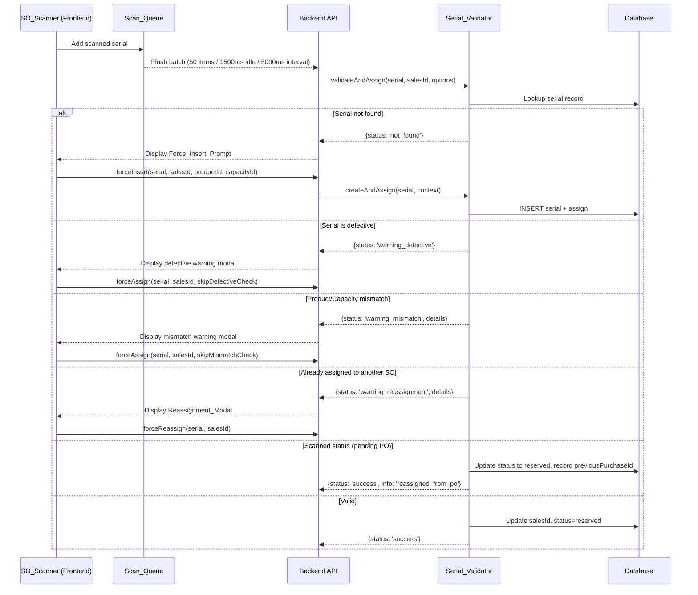
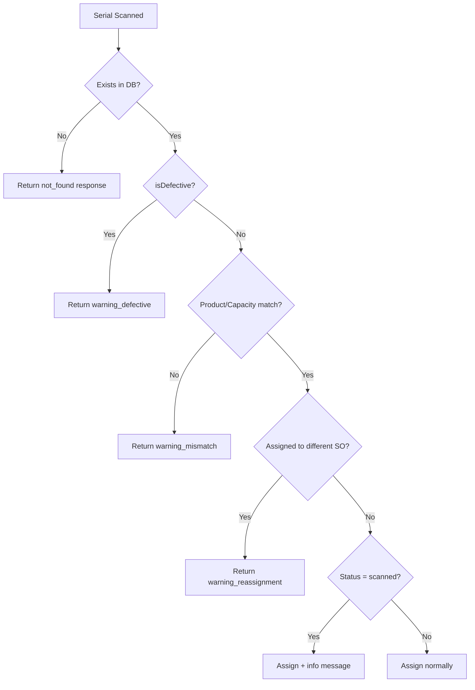

# Design Document: SO Serial Scan Validation

## Overview

This design extends the existing serial number scanning subsystem for Sales Order (SO) and Schedule Today SO pages. The current implementation performs basic product/capacity matching and returns hard failures that the frontend displays as error modals. This feature refactors the validation pipeline to support **soft warnings** with user confirmation flows, **force-insert** for non-existing serials, **scanned-status acceptance**, and a **rejected scan counter** for operational visibility.

The key architectural change is introducing a structured validation response that distinguishes between hard failures (invalid input, system errors), soft warnings (mismatch, defective, already-assigned), and informational messages (scanned-status reassignment). The frontend will interpret these response types and present appropriate modals for user decision-making, rather than treating all non-success responses as blocking errors.

### Design Rationale

- **Batch size/timer alignment**: PO scanning already uses 50/1500ms. Applying the same values to SO scanning ensures consistent behavior and prevents queue overflow during rapid barcode scanning.
- **Soft warnings over hard blocks**: Warehouse operators need speed. Validation should inform, not block. The user can override warnings with explicit confirmation.
- **Force-insert**: Serials may arrive before admin data entry. Allowing force-insert keeps the scanning flow uninterrupted while maintaining audit trail.
- **Rejected scan counter**: Silent failures during batch processing are invisible to operators. A visible counter provides immediate feedback.

## Architecture



### Processing Flow Change

The current `scanSalesOrder` method returns a binary `{success, message}`. This design introduces a richer response envelope:



## Components and Interfaces

### Backend: Enhanced Scan Response

The `scanSalesOrder` method response will be extended to include a `validationStatus` field that the frontend uses to determine which modal to show:

```typescript
interface ScanSalesOrderResponse {
  success: boolean;
  message: string;
  validationStatus?: 
    | 'ok'
    | 'not_found'
    | 'warning_defective'
    | 'warning_mismatch'
    | 'warning_reassignment'
    | 'info_scanned_status';
  details?: {
    // For mismatch warnings
    expectedProductName?: string;
    expectedCapacityName?: string;
    actualProductName?: string;
    actualCapacityName?: string;
    // For reassignment warnings
    currentCustomerName?: string;
    currentSoNumber?: string;
    currentSalesId?: number;
    // For scanned-status info
    previousPoNumber?: string;
    previousPurchaseId?: number;
  };
  item?: SerialScanResultItem;
}
```

### Backend: New DTO Extensions

```typescript
// Extended ScanSalesOrderDto
interface ScanSalesOrderDto {
  serialNumber: string;
  salesId: number;
  branchId?: number;
  expectedProductId?: number;
  expectedCapacityId?: number;
  expectedUnitType?: string;
  // New fields for force operations
  forceAssign?: boolean;       // Skip mismatch and defective warnings
  forceInsert?: boolean;       // Create serial if not found
  forceReassign?: boolean;     // Reassign from another SO
}
```

### Backend: Validation Pipeline

The `scanSalesOrder` method validation order:

1. Input validation (serialNumber, salesId) — hard fail
2. Serial lookup — if not found, return `not_found` (unless `forceInsert`)
3. Defective check — if defective, return `warning_defective` (unless `forceAssign`)
4. Product/Capacity mismatch — return `warning_mismatch` (unless `forceAssign`)
5. Already-assigned check — return `warning_reassignment` (unless `forceReassign`)
6. Scanned-status handling — proceed with informational message
7. Normal assignment

### Frontend: Scan Queue Enhancement

Both the Sales Order and Schedule Today SO pages will be updated:

```typescript
// Updated constants
private readonly serialBatchSize = 50;        // Was 20 on Schedule Today
private readonly serialBatchIdleMs = 1500;    // Was 1000 on Schedule Today
private readonly serialBatchIntervalMs = 5000; // Unchanged

// New state
private rejectedScanCount = 0;
private rejectedScanList: Array<{ serialNumber: string; reason: string; timestamp: Date }> = [];
```

### Frontend: Warning Modal Handling

The frontend will process batch responses and extract items that require user confirmation. These items are removed from the batch result and presented one at a time via modals:

```typescript
interface PendingValidationWarning {
  serialNumber: string;
  productIndex: number;
  unitLabel: string;
  validationStatus: string;
  details: ScanResponseDetails;
  salesId: number;
  productId: number;
  capacityId: number;
}
```

When a batch flush returns items with `validationStatus` in `['not_found', 'warning_defective', 'warning_mismatch', 'warning_reassignment']`, the frontend queues them for sequential user confirmation.

### Frontend: Modal Components

Three modal types reusing the existing SO Session Guard dialog pattern:

1. **Mismatch Warning Modal** — Shows expected vs actual product/capacity, with "Confirm Scan" and "Cancel" buttons
2. **Defective Warning Modal** — Shows defective indicator with "Confirm Scan" and "Cancel" buttons  
3. **Reassignment Modal** — Shows current customer/SO information with "Force Reassign" and "Cancel" buttons
4. **Force Insert Prompt** — Shows serial not found message with "Create & Assign" and "Cancel" buttons

All modals follow the `SalesGuardDialogMode` pattern already established in the codebase.

## Data Models

### Serial Number Table (tblserial_numbers)

No schema changes required. The existing table already has all necessary columns:

| Column | Type | Purpose |
|--------|------|---------|
| `serialNumber` | VARCHAR | Unique serial identifier |
| `salesId` | BIGINT | Current SO assignment |
| `previousSalesId` | BIGINT | Previous SO before reassignment |
| `purchaseId` | INTEGER | Current PO reference |
| `previousPurchaseId` | INTEGER | Previous PO before reassignment |
| `productId` | BIGINT | Product reference |
| `capacityId` | BIGINT | Capacity reference |
| `unitType` | VARCHAR | Unit type label |
| `status` | VARCHAR | Current status (scanned, reserved, sold, etc.) |
| `isDefective` | BOOLEAN | Defective flag |
| `branchId` | BIGINT | Branch reference |
| `created_by` | BIGINT | User who created/modified |

### Validation Response Shape

```typescript
// Backend response for individual scan within batch
interface BatchScanResultItem {
  serialNumber: string;
  success: boolean;
  message?: string;
  validationStatus?: string;
  details?: Record<string, unknown>;
  item?: {
    serialNumber?: string | null;
  };
}

// Enhanced batch response
interface ScanSalesOrderBatchResponse {
  success: boolean;
  message: string;
  summary: {
    total: number;
    successCount: number;
    failureCount: number;
    warningCount: number;  // New: items needing user confirmation
  };
  items: BatchScanResultItem[];
}
```

### Session State (Frontend)

```typescript
interface RejectedScanEntry {
  serialNumber: string;
  reason: string;
  timestamp: Date;
}

// Per-session state on both SO pages
interface ScanSessionState {
  rejectedScanCount: number;
  rejectedScanList: RejectedScanEntry[];
}
```

## Correctness Properties

*A property is a characteristic or behavior that should hold true across all valid executions of a system — essentially, a formal statement about what the system should do. Properties serve as the bridge between human-readable specifications and machine-verifiable correctness guarantees.*

### Property 1: Product/Capacity Mismatch Detection

*For any* serial number record with a productId or capacityId that differs from the expected productId or capacityId provided in the scan request, the Serial_Validator SHALL return a response with `validationStatus = 'warning_mismatch'` containing the expected and actual product/capacity names, when `forceAssign` is not set to true.

**Validates: Requirements 2.1, 2.2, 2.3**

### Property 2: Force-Assign Overrides Warnings

*For any* serial number that would normally trigger a warning response (mismatch or defective), when the scan request includes `forceAssign = true`, the Serial_Validator SHALL proceed with assignment and return a success response with the serial assigned to the specified salesId.

**Validates: Requirements 2.5, 3.4**

### Property 3: Defective Serial Detection

*For any* serial number record with `isDefective = true`, when scanned without `forceAssign = true`, the Serial_Validator SHALL return a response with `validationStatus = 'warning_defective'` and SHALL NOT assign the serial to the sales order.

**Validates: Requirements 3.1, 3.3**

### Property 4: Non-Existing Serial Force-Insert

*For any* serial number string that does not exist in the database, when `forceInsert = true` is provided along with valid productId, capacityId, and unitType, the Serial_Validator SHALL create a new serial record with matching productId, capacityId, unitType, and created_by fields, and assign it to the specified salesId.

**Validates: Requirements 4.1, 4.3, 4.4, 4.6**

### Property 5: Scanned-Status Serial Acceptance and State Transition

*For any* serial number with status "scanned" and a non-null purchaseId, when assigned to a sales order, the Serial_Validator SHALL update the status to "reserved" AND record the original purchaseId in the `previousPurchaseId` field.

**Validates: Requirements 5.1, 5.3, 5.4**

### Property 6: Force-Reassignment Records Previous Assignment

*For any* serial number currently assigned to salesId A, when force-reassigned to salesId B (where A ≠ B), the Serial_Validator SHALL update the salesId to B AND record A in the `previousSalesId` field.

**Validates: Requirements 6.4, 6.5**

### Property 7: Already-Assigned Response Contains Required Details

*For any* serial number assigned to a different sales order, when scanned without `forceReassign = true`, the Serial_Validator SHALL return a response containing the current customer name, current SO number, and the serial number.

**Validates: Requirements 6.1**

### Property 8: Rejected Scan Counter Accuracy

*For any* sequence of N scan rejection events (network failure, timeout, or backend error) within a single scanning session, the rejected scan count SHALL equal N and the rejected scan list SHALL contain exactly N entries, each with the corresponding serial number and rejection reason.

**Validates: Requirements 7.1, 7.2, 7.4, 7.5**

### Property 9: Session Reset Clears Rejection State

*For any* prior session state with a non-zero rejected scan count and non-empty rejected scan list, when a new scanning session is opened (new SO detail), the rejected scan count SHALL be zero and the rejected scan list SHALL be empty.

**Validates: Requirements 7.6**

## Error Handling

### Backend Error Categories

| Error Type | Response | Frontend Action |
|-----------|----------|-----------------|
| Invalid input (empty serial, invalid salesId) | `{success: false}` hard failure | Increment rejected counter, show error |
| Database connection error | 500 exception | Increment rejected counter, re-queue batch |
| Serial not found (no forceInsert) | `{success: false, validationStatus: 'not_found'}` | Show Force_Insert_Prompt |
| Defective serial (no forceAssign) | `{success: false, validationStatus: 'warning_defective'}` | Show defective warning modal |
| Product/Capacity mismatch (no forceAssign) | `{success: false, validationStatus: 'warning_mismatch'}` | Show mismatch warning modal |
| Already assigned (no forceReassign) | `{success: false, validationStatus: 'warning_reassignment'}` | Show Reassignment_Modal |
| Network timeout during batch flush | Axios error | Re-queue batch, increment rejected counter |

### Retry Strategy

- **Batch flush network errors**: Re-queue the entire batch and schedule a retry via the idle timer. This matches the existing behavior in `flushQueuedSerialScans`.
- **Individual item failures within a batch**: Remove the serial from the local UI list, increment rejected counter, record in rejected list.
- **Warning responses**: Do NOT count as rejections. They are pending user decisions.

### Modal Queue Processing

When multiple items in a batch return warning statuses, the frontend processes them sequentially:
1. First warning is presented immediately
2. Subsequent warnings queue behind it
3. On confirm: re-send the individual scan with the appropriate force flag
4. On cancel: discard from queue, increment rejected counter

## Testing Strategy

### Unit Tests (Jest)

- **Backend `scanSalesOrder` method**: Test each validation branch with specific examples:
  - Serial not found returns `not_found` status
  - Defective serial returns `warning_defective` status
  - Mismatched product returns `warning_mismatch` with correct detail fields
  - Already-assigned serial returns customer name and SO number
  - `forceAssign=true` bypasses mismatch and defective checks
  - `forceInsert=true` creates a new record
  - `forceReassign=true` updates salesId and records previousSalesId
  - Scanned-status serial gets status updated to "reserved" with previousPurchaseId set
  
- **Frontend rejected scan counter**: Test increment/reset behavior
- **Frontend batch size constants**: Verify values are 50/1500/5000

### Property-Based Tests (fast-check with Jest)

Property-based testing is appropriate for this feature because the Serial_Validator contains pure validation logic with clear input/output behavior that varies meaningfully across different serial states, product/capacity combinations, and force flags.

**Library**: `fast-check` (JavaScript/TypeScript property-based testing library)  
**Configuration**: Minimum 100 iterations per property test  
**Tag format**: `Feature: so-serial-scan-validation, Property {N}: {title}`

Each correctness property defined above will be implemented as a single property-based test:

1. **Property 1**: Generate random serial records with random productId/capacityId pairs and random expected values. Verify mismatch detection is accurate.
2. **Property 2**: Generate random serials that would trigger warnings, attach `forceAssign=true`, verify success.
3. **Property 3**: Generate random serials with `isDefective=true`, verify warning response without assignment.
4. **Property 4**: Generate random non-existing serial strings with valid product/capacity/unitType contexts, verify creation and assignment.
5. **Property 5**: Generate random serials with status "scanned" and purchaseIds, verify state transition.
6. **Property 6**: Generate random reassignment scenarios, verify previousSalesId recording.
7. **Property 7**: Generate random already-assigned serials, verify response detail completeness.
8. **Property 8**: Generate random sequences of rejection events, verify counter/list accuracy.
9. **Property 9**: Generate random prior states, verify reset clears everything.

### Integration Tests

- End-to-end scan flow: scan a real serial through the API and verify database state
- Batch flush: submit a batch of mixed valid/invalid/warning serials and verify response shape
- Force-insert: create a serial via force-insert and verify it appears in subsequent queries
